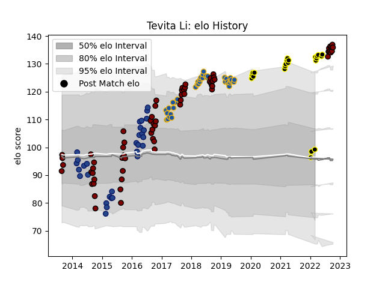

---  
layout: page  
title: Tevita Li  
date: 2022-12-28 12:53:06.802207  
categories: player  
---
# Tevita Li

## Positions: W

## Current elo: 97.0

## Current Percentile: None

# Elo History

# Match History

| Team             |   Appearances |   Win Rate |
|:-----------------|--------------:|-----------:|
| North Harbour    |            64 |   0.5      |
| Highlanders      |            37 |   0.648649 |
| Blues            |            30 |   0.416667 |
| Tokyo Sungoliath |            15 |   0.733333 |

| Opponent                          |   Matches |   Win Rate |
|:----------------------------------|----------:|-----------:|
| Chiefs                            |         9 |   0.166667 |
| Crusaders                         |         7 |   0.285714 |
| Northland                         |         7 |   0.785714 |
| Hurricanes                        |         7 |   0.142857 |
| Counties Manukau                  |         6 |   0.833333 |
| Blues                             |         6 |   0.833333 |
| Wellington                        |         6 |   0.166667 |
| New South Wales Waratahs          |         5 |   0.6      |
| Southland                         |         5 |   0.8      |
| Auckland                          |         5 |   0.2      |
| Manawatu                          |         5 |   0.6      |
| Tasman                            |         5 |   0.3      |
| Canterbury                        |         5 |   0.2      |
| Bay of Plenty                     |         5 |   0.4      |
| Queensland Reds                   |         4 |   0.875    |
| Otago                             |         4 |   0.25     |
| Waikato                           |         4 |   0.5      |
| Western Force                     |         4 |   1        |
| Melbourne Rebels                  |         4 |   0.75     |
| Hawke's Bay                       |         4 |   0.5      |
| Cheetahs                          |         3 |   0.666667 |
| Taranaki                          |         3 |   1        |
| Brumbies                          |         3 |   0.666667 |
| Bulls                             |         3 |   0.5      |
| Sharks                            |         2 |   0.5      |
| Green Rockets Tokatsu             |         2 |   1        |
| Toshiba Brave Lupus Tokyo         |         2 |   0.5      |
| Sunwolves                         |         2 |   1        |
| Kubota Spears Funabashi Tokyo-Bay |         2 |   0.5      |
| Toyota Verblitz                   |         2 |   1        |
| Urayasu D-Rocks                   |         2 |   1        |
| Highlanders                       |         2 |   0.5      |
| Jaguares                          |         2 |   1        |
| Kobelco Kobe Steelers             |         2 |   0.5      |
| British and Irish Lions           |         1 |   1        |
| Lions                             |         1 |   0        |
| Stormers                          |         1 |   0        |
| Southern Kings                    |         1 |   1        |
| Saitama Wild Knights              |         1 |   0        |
| NTT Docomo Red Hurricanes Osaka   |         1 |   1        |
| Yokohama Canon Eagles             |         1 |   1        |