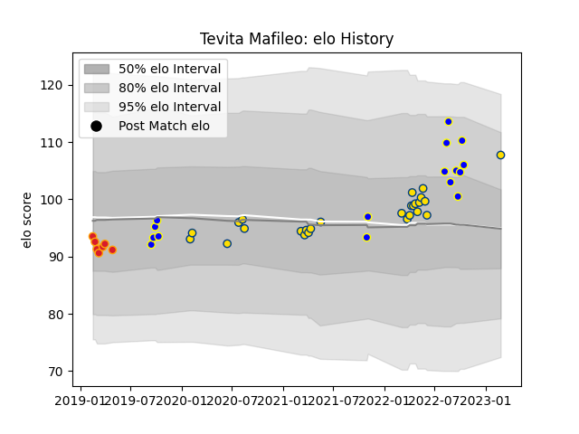

---  
layout: page  
title: Tevita Mafileo  
date: 2023-03-02 11:21:26.897380  
categories: player  
---
# Tevita Mafileo

## Positions: P

## Current elo: 108.0

## Current Percentile: 83.0

# Elo History

# Match History

| Team          |   Appearances |   Win Rate |
|:--------------|--------------:|-----------:|
| Hurricanes    |            26 |   0.5      |
| Bay of Plenty |            16 |   0.6875   |
| Chiefs        |             7 |   0.285714 |

| Opponent                 |   Matches |   Win Rate |
|:-------------------------|----------:|-----------:|
| Crusaders                |         5 |   0.2      |
| Highlanders              |         5 |   0.6      |
| Brumbies                 |         3 |   0        |
| Waikato                  |         3 |   0.333333 |
| Chiefs                   |         3 |   0.333333 |
| Hawke's Bay              |         2 |   1        |
| Jaguares                 |         2 |   1        |
| New South Wales Waratahs |         2 |   1        |
| Moana Pasifika           |         2 |   0.5      |
| Southland                |         2 |   1        |
| Blues                    |         2 |   0        |
| Northland                |         2 |   1        |
| Queensland Reds          |         2 |   1        |
| Taranaki                 |         2 |   1        |
| Stormers                 |         1 |   0        |
| Sunwolves                |         1 |   0        |
| Wellington               |         1 |   0        |
| Auckland                 |         1 |   1        |
| Manawatu                 |         1 |   1        |
| Melbourne Rebels         |         1 |   1        |
| Hurricanes               |         1 |   0        |
| Fijian Drua              |         1 |   1        |
| Counties Manukau         |         1 |   0        |
| Canterbury               |         1 |   0        |
| Bulls                    |         1 |   1        |
| Western Force            |         1 |   0        |