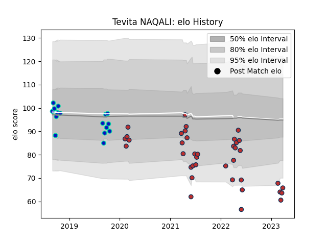

---  
layout: page  
title: Tevita NAQALI  
date: 2023-03-09 10:09:46.476344  
categories: player  
---
# Tevita NAQALI

## Positions: L

## Current elo: 64.0

## Current Percentile: 5.0

# Elo History

# Match History

| Team         |   Appearances |   Win Rate |
|:-------------|--------------:|-----------:|
| Old Glory DC |            35 |   0.357143 |
| Fijian Drua  |            16 |   0.6875   |

| Opponent               |   Matches |   Win Rate |
|:-----------------------|----------:|-----------:|
| Rugby New York         |         5 |   0        |
| NOLA Gold              |         5 |   0.1      |
| Toronto Arrows         |         4 |   0.25     |
| Rugby ATL              |         4 |   0.5      |
| R.U. New York          |         4 |   0        |
| New England Free Jacks |         3 |   0.333333 |
| Canberra Vikings       |         3 |   0.333333 |
| Queensland Country     |         3 |   0.666667 |
| NSW Country Eagles     |         2 |   0.75     |
| Sydney Rays            |         2 |   1        |
| Western Force          |         2 |   0.5      |
| Melbourne Rising       |         2 |   1        |
| Houston SaberCats      |         2 |   0.5      |
| Brisbane City          |         2 |   0.75     |
| Austin Herd            |         1 |   1        |
| L. A. Giltinis         |         1 |   0        |
| Dallas Jackals         |         1 |   1        |
| San Diego Legion       |         1 |   1        |
| Seattle Seawolves      |         1 |   1        |
| Chicago Hounds         |         1 |   1        |
| Utah Warriors          |         1 |   1        |
| Austin Gilgronis       |         1 |   1        |