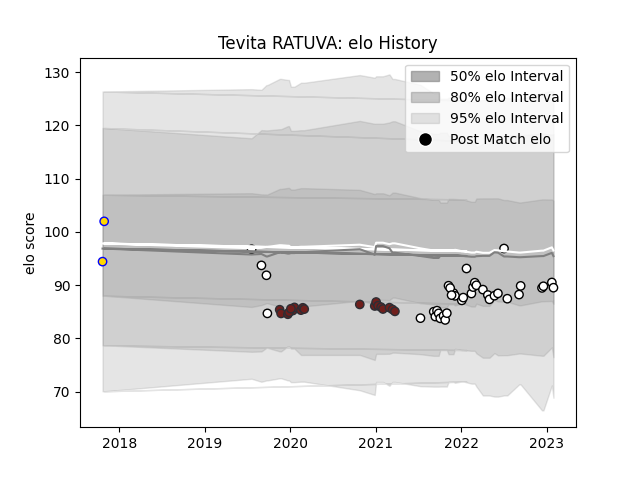

---  
layout: page  
title: Tevita RATUVA  
date: 2023-01-23 15:34:37.443610  
categories: player  
---
# Tevita RATUVA

## Positions: L

## Country: Fiji

## Current elo: 91.0

## Current Percentile: 32.0

# Elo History

# Match History

| Team          |   Appearances |   Win Rate |
|:--------------|--------------:|-----------:|
| Brive         |            27 |   0.314815 |
| Scarlets      |            19 |   0.526316 |
| Fiji          |            10 |   0.35     |
| Brisbane City |             2 |   0.25     |

| Opponent             |   Matches |   Win Rate |
|:---------------------|----------:|-----------:|
| Cardiff Blues        |         5 |   0.4      |
| Perpignan            |         3 |   0.666667 |
| Toulon               |         3 |   0.333333 |
| Lyon                 |         3 |   0        |
| Edinburgh            |         3 |   0.333333 |
| Montpellier Herault  |         2 |   0.25     |
| Pau                  |         2 |   0.5      |
| Munster              |         2 |   0        |
| London Irish         |         2 |   1        |
| Stade Francais Paris |         2 |   1        |
| La Rochelle          |         2 |   0        |
| Stade Toulousain     |         2 |   0        |
| Tonga                |         2 |   1        |
| Dragons              |         2 |   0.5      |
| Connacht             |         2 |   0.5      |
| Clermont Auvergne    |         2 |   0.5      |
| Bordeaux Begles      |         2 |   0        |
| Ospreys              |         2 |   1        |
| Spain                |         1 |   1        |
| Southern Kings       |         1 |   1        |
| Samoa                |         1 |   0        |
| Uruguay              |         1 |   0        |
| Australia            |         1 |   0        |
| New Zealand Maori    |         1 |   0        |
| New Zealand          |         1 |   0        |
| NSW Country Eagles   |         1 |   0.5      |
| Benetton Treviso     |         1 |   1        |
| Leinster             |         1 |   0        |
| Greater Sydney Rams  |         1 |   0        |
| Georgia              |         1 |   0.5      |
| Castres Olympique    |         1 |   0        |
| Biarritz Olympique   |         1 |   0        |
| Wales                |         1 |   0        |