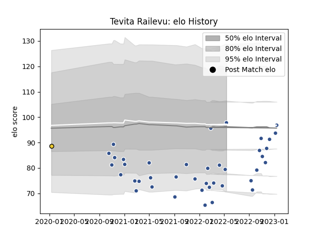

---  
layout: page  
title: Tevita Railevu  
date: 2022-11-22 11:32:44.736551  
categories: player  
---
# Tevita Railevu

## Positions: W

## Current elo: 94.0

## Current Percentile: 52.0

# Elo History

# Match History

| Team        |   Appearances |   Win Rate |
|:------------|--------------:|-----------:|
| Agen        |            34 |   0.264706 |
| La Rochelle |             1 |   1        |

| Opponent            |   Matches |   Win Rate |
|:--------------------|----------:|-----------:|
| Aurillac            |         2 |        0.5 |
| Grenoble            |         2 |        0.5 |
| Toulon              |         2 |        0   |
| Nevers              |         2 |        0.5 |
| La Rochelle         |         2 |        0   |
| Montpellier Herault |         2 |        0   |
| Vannes              |         2 |        1   |
| Carcassonne         |         2 |        0.5 |
| Beziers             |         2 |        0   |
| Pau                 |         1 |        0   |
| US Bressane         |         1 |        0   |
| Soyaux-Angouleme    |         1 |        0   |
| Sale Sharks         |         1 |        1   |
| Rouen               |         1 |        1   |
| Racing 92           |         1 |        0   |
| Provence Rugby      |         1 |        0   |
| Colomiers           |         1 |        0   |
| Clermont Auvergne   |         1 |        0   |
| Bordeaux Begles     |         1 |        0   |
| Narbonne            |         1 |        1   |
| Bayonne             |         1 |        0   |
| Montauban           |         1 |        0   |
| Mont-de-Marsan      |         1 |        1   |
| Lyon                |         1 |        0   |
| London Irish        |         1 |        0   |
| Oyonnax             |         1 |        0   |