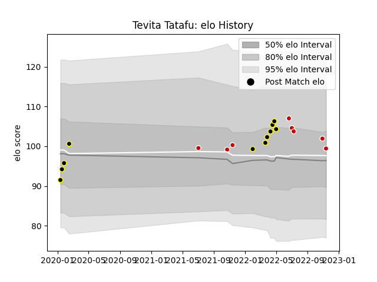

---  
layout: page  
title: Tevita Tatafu  
date: 2022-11-15 23:36:10.475241  
categories: player  
---
# Tevita Tatafu

## Positions: N8

## Country: Japan

## Current elo: 99.0

## Current Percentile: 67.0

# Elo History

# Match History

| Team             |   Appearances |   Win Rate |
|:-----------------|--------------:|-----------:|
| Tokyo Sungoliath |            11 |   0.727273 |
| Japan            |             8 |   0.25     |

| Opponent                        |   Matches |   Win Rate |
|:--------------------------------|----------:|-----------:|
| Black Rams Tokyo                |         2 |          1 |
| France                          |         2 |          0 |
| Toshiba Brave Lupus Tokyo       |         2 |          0 |
| Urayasu D-Rocks                 |         2 |          1 |
| Australia                       |         1 |          0 |
| England                         |         1 |          0 |
| Ireland                         |         1 |          0 |
| Kobelco Kobe Steelers           |         1 |          0 |
| NTT Docomo Red Hurricanes Osaka |         1 |          1 |
| New Zealand                     |         1 |          0 |
| Portugal                        |         1 |          1 |
| Shizuoka Blue Revs              |         1 |          1 |
| Toyota Verblitz                 |         1 |          1 |
| Uruguay                         |         1 |          1 |
| Yokohama Canon Eagles           |         1 |          1 |