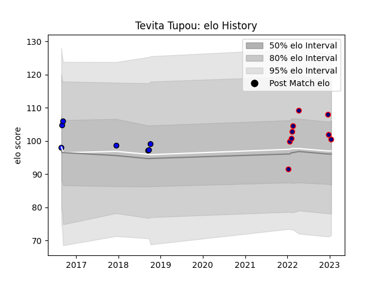

---  
layout: page  
title: Tevita Tupou  
date: 2023-01-15 11:54:10.155308  
categories: player  
---
# Tevita Tupou

## Positions: FL, N8

## Current elo: 100.0

## Current Percentile: 66.0

# Elo History

# Match History

| Team                     |   Appearances |   Win Rate |
|:-------------------------|--------------:|-----------:|
| Hanazono Kintetsu Liners |             9 |   0.555556 |
| Saitama Wild Knights     |             7 |   0.857143 |

| Opponent                  |   Matches |   Win Rate |
|:--------------------------|----------:|-----------:|
| Kamaishi Seawaves         |         2 |        1   |
| Kobelco Kobe Steelers     |         2 |        0.5 |
| Mie Honda Heat            |         2 |        1   |
| Shizuoka Blue Revs        |         2 |        0.5 |
| Green Rockets Tokatsu     |         1 |        0   |
| Hanazono Kintetsu Liners  |         1 |        1   |
| Hino Red Dolphins         |         1 |        1   |
| Mitsubishi Dynaboars      |         1 |        0   |
| Munakata Sanix Blues      |         1 |        1   |
| Skyactivs Hiroshima       |         1 |        1   |
| Toshiba Brave Lupus Tokyo |         1 |        1   |
| Yokohama Canon Eagles     |         1 |        0   |