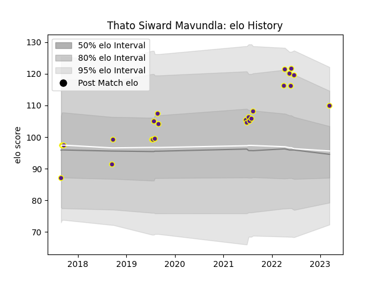

---  
layout: page  
title: Thato Siward Mavundla  
date: 2023-03-17 16:59:50.841447  
categories: player  
---
# Thato Siward Mavundla

## Positions: FL

## Current elo: 110.0

## Current Percentile: 92.0

# Elo History

# Match History

| Team     |   Appearances |   Win Rate |
|:---------|--------------:|-----------:|
| Griffons |            25 |       0.76 |

| Opponent               |   Matches |   Win Rate |
|:-----------------------|----------:|-----------:|
| Eastern Province Kings |         5 |   1        |
| Boland Cavaliers       |         4 |   0.75     |
| Leopards               |         4 |   0.5      |
| Valke                  |         3 |   0.833333 |
| Border Bulldogs        |         2 |   1        |
| SWD Eagles             |         2 |   0.75     |
| Black Lion             |         1 |   1        |
| Jaguares XV            |         1 |   0        |
| Namibia Welwitchias    |         1 |   1        |
| Natal Sharks           |         1 |   0        |
| Zimbabwe Goshawks      |         1 |   1        |