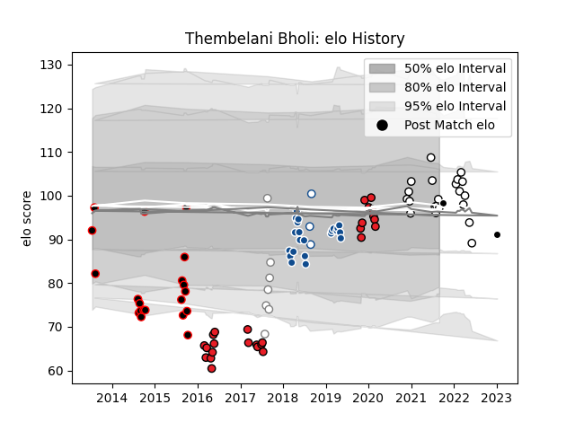

---  
layout: page  
title: Thembelani Bholi  
date: 2023-03-17 17:34:20.013768  
categories: player  
---
# Thembelani Bholi

## Positions: FL

## Current elo: 97.0

## Current Percentile: 43.0

# Elo History

# Match History

| Team                   |   Appearances |   Win Rate |
|:-----------------------|--------------:|-----------:|
| Southern Kings         |            26 |   0.192308 |
| Natal Sharks           |            24 |   0.541667 |
| Bulls                  |            22 |   0.454545 |
| Eastern Province Kings |            20 |   0.25     |
| Pumas                  |             7 |   0.428571 |
| Blue Bulls             |             3 |   0.333333 |
| Sharks                 |             1 |   0        |

| Opponent                 |   Matches |   Win Rate |
|:-------------------------|----------:|-----------:|
| Golden Lions             |         9 |   0.222222 |
| Free State Cheetahs      |         8 |   0.5      |
| Blue Bulls               |         8 |   0.375    |
| Griquas                  |         8 |   0.75     |
| Jaguares                 |         7 |   0.428571 |
| Western Province         |         7 |   0.285714 |
| Natal Sharks             |         6 |   0        |
| Stormers                 |         5 |   0.4      |
| Pumas                    |         5 |   0.6      |
| Sharks                   |         5 |   0.6      |
| Lions                    |         4 |   0        |
| Cheetahs                 |         4 |   0        |
| Glasgow Warriors         |         2 |   0        |
| Chiefs                   |         2 |   0        |
| Sunwolves                |         2 |   0.5      |
| Crusaders                |         2 |   0        |
| Connacht                 |         2 |   0        |
| Brumbies                 |         2 |   0        |
| New South Wales Waratahs |         1 |   1        |
| Scarlets                 |         1 |   0        |
| Valke                    |         1 |   1        |
| Queensland Reds          |         1 |   1        |
| Ospreys                  |         1 |   1        |
| Benetton Treviso         |         1 |   0        |
| Munster                  |         1 |   0        |
| Melbourne Rebels         |         1 |   1        |
| Leopards                 |         1 |   0        |
| Highlanders              |         1 |   0        |
| Edinburgh                |         1 |   0        |
| Bulls                    |         1 |   1        |
| Border Bulldogs          |         1 |   1        |
| Blues                    |         1 |   0        |
| Hurricanes               |         1 |   1        |