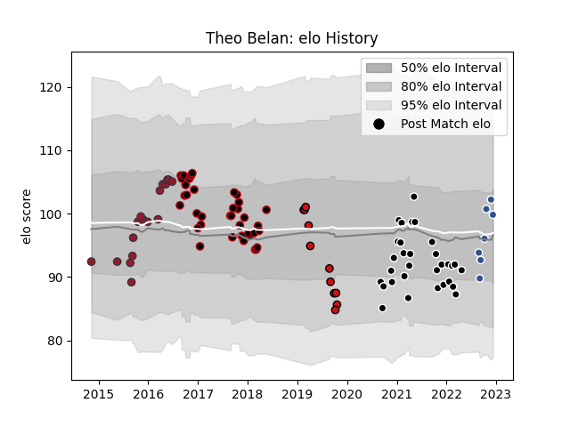

---  
layout: page  
title: Theo Belan  
date: 2022-12-09 13:21:50.014726  
categories: player  
---
# Theo Belan

## Positions: C

## Current elo: 99.0

## Current Percentile: 71.0

# Elo History

# Match History

| Team             |   Appearances |   Win Rate |
|:-----------------|--------------:|-----------:|
| Lyon             |            38 |   0.460526 |
| Provence Rugby   |            31 |   0.516129 |
| Toulon           |            17 |   0.470588 |
| Stade Toulousain |            11 |   0.545455 |
| Agen             |             7 |   0.428571 |

| Opponent                   |   Matches |   Win Rate |
|:---------------------------|----------:|-----------:|
| Racing 92                  |         7 |   0.428571 |
| Castres Olympique          |         7 |   0.428571 |
| Grenoble                   |         6 |   0.666667 |
| Toulon                     |         5 |   0.5      |
| Bordeaux Begles            |         5 |   0.4      |
| Brive                      |         5 |   0.3      |
| Montpellier Herault        |         5 |   0.4      |
| La Rochelle                |         4 |   0.5      |
| Montauban                  |         4 |   0.75     |
| Stade Toulousain           |         4 |   0.5      |
| Pau                        |         4 |   0.75     |
| Oyonnax                    |         4 |   0.25     |
| Aurillac                   |         4 |   0.5      |
| Stade Francais Paris       |         4 |   0.75     |
| Clermont Auvergne          |         4 |   0.25     |
| Beziers                    |         3 |   0.333333 |
| Bayonne                    |         3 |   0.5      |
| Mont-de-Marsan             |         2 |   0.5      |
| Colomiers                  |         2 |   0.5      |
| Nevers                     |         2 |   0.5      |
| US Bressane                |         2 |   0.75     |
| Cardiff Blues              |         2 |   0        |
| Carcassonne                |         2 |   0.5      |
| Agen                       |         2 |   1        |
| Valence Romans Drome Rugby |         1 |   1        |
| Soyaux-Angouleme           |         1 |   1        |
| Vannes                     |         1 |   0        |
| Narbonne                   |         1 |   0        |
| Sale Sharks                |         1 |   1        |
| Rouen                      |         1 |   1        |
| Provence Rugby             |         1 |   1        |
| Perpignan                  |         1 |   0        |
| Ospreys                    |         1 |   0        |
| Lyon                       |         1 |   0        |
| Biarritz Olympique         |         1 |   0.5      |
| Wasps                      |         1 |   0        |