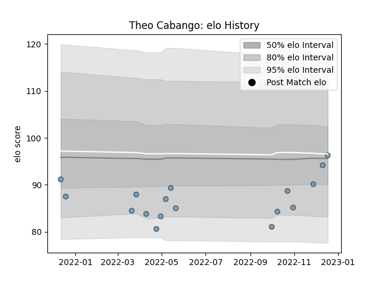

---  
layout: page  
title: Theo Cabango  
date: 2022-12-14 11:33:10.422733  
categories: player  
---
# Theo Cabango

## Positions: W

## Current elo: 94.0

## Current Percentile: 25.0

# Elo History

# Match History

| Team          |   Appearances |   Win Rate |
|:--------------|--------------:|-----------:|
| Cardiff Blues |            16 |     0.4375 |

| Opponent         |   Matches |   Win Rate |
|:-----------------|----------:|-----------:|
| Scarlets         |         2 |        0.5 |
| Stormers         |         2 |        0.5 |
| Benetton Treviso |         1 |        0   |
| Brive            |         1 |        1   |
| Dragons          |         1 |        1   |
| Edinburgh        |         1 |        0   |
| Glasgow Warriors |         1 |        1   |
| Harlequins       |         1 |        0   |
| Lions            |         1 |        0   |
| Munster          |         1 |        0   |
| Ospreys          |         1 |        0   |
| Sharks           |         1 |        1   |
| Stade Toulousain |         1 |        0   |
| Zebre            |         1 |        1   |