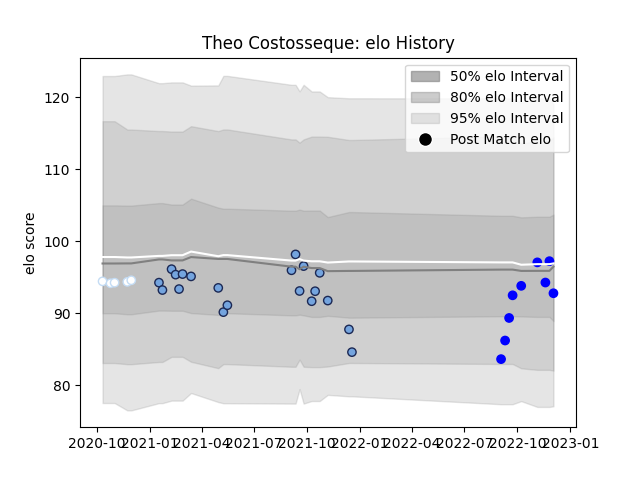

---  
layout: page  
title: Theo Costosseque  
date: 2022-12-09 13:14:04.381895  
categories: player  
---
# Theo Costosseque

## Positions: C, W

## Current elo: 93.0

## Current Percentile: 55.0

# Elo History

# Match History

| Team      |   Appearances |   Win Rate |
|:----------|--------------:|-----------:|
| Bayonne   |            20 |   0.575    |
| Vannes    |             9 |   0.722222 |
| Racing 92 |             5 |   0.4      |

| Opponent             |   Matches |   Win Rate |
|:---------------------|----------:|-----------:|
| Castres Olympique    |         3 |       0    |
| Grenoble             |         2 |       1    |
| Montauban            |         2 |       0.75 |
| Beziers              |         2 |       1    |
| Stade Toulousain     |         2 |       0.5  |
| Rouen                |         2 |       0.5  |
| Colomiers            |         2 |       0.5  |
| Nevers               |         2 |       0.75 |
| La Rochelle          |         2 |       0    |
| Mont-de-Marsan       |         2 |       0    |
| Toulon               |         1 |       1    |
| Stade Francais Paris |         1 |       1    |
| Provence Rugby       |         1 |       1    |
| Pau                  |         1 |       0    |
| Agen                 |         1 |       1    |
| Aurillac             |         1 |       1    |
| Clermont Auvergne    |         1 |       0    |
| Carcassonne          |         1 |       1    |
| Brive                |         1 |       1    |
| Bordeaux Begles      |         1 |       0    |
| Biarritz Olympique   |         1 |       1    |
| Bayonne              |         1 |       1    |
| Vannes               |         1 |       1    |