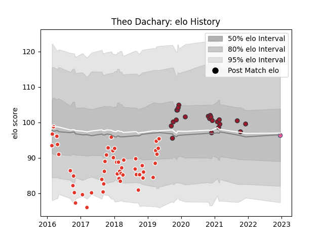

---  
layout: page  
title: Theo Dachary  
date: 2022-12-18 16:16:16.275935  
categories: player  
---
# Theo Dachary

## Positions: C

## Current elo: 96.0

## Current Percentile: None

# Elo History

# Match History

| Team                 |   Appearances |   Win Rate |
|:---------------------|--------------:|-----------:|
| Biarritz Olympique   |            50 |   0.55     |
| Toulon               |            22 |   0.659091 |
| Stade Francais Paris |             1 |   0        |

| Opponent             |   Matches |   Win Rate |
|:---------------------|----------:|-----------:|
| Brive                |         6 |   0.583333 |
| Carcassonne          |         6 |   0.5      |
| Bayonne              |         5 |   0.6      |
| Soyaux-Angouleme     |         4 |   0.25     |
| Pau                  |         4 |   0.875    |
| Vannes               |         3 |   0.333333 |
| Mont-de-Marsan       |         3 |   0.333333 |
| Aurillac             |         3 |   1        |
| Beziers              |         3 |   1        |
| Colomiers            |         3 |   0        |
| Perpignan            |         3 |   0.666667 |
| Nevers               |         3 |   0.666667 |
| Montauban            |         3 |   0.666667 |
| Provence Rugby       |         2 |   1        |
| Narbonne             |         2 |   1        |
| Montpellier Herault  |         2 |   0.5      |
| Agen                 |         2 |   1        |
| La Rochelle          |         2 |   0.5      |
| Dax                  |         2 |   0        |
| Massy                |         2 |   0.5      |
| Albi                 |         1 |   0        |
| Lyon                 |         1 |   0        |
| London Irish         |         1 |   1        |
| Lions                |         1 |   0        |
| Oyonnax              |         1 |   1        |
| Grenoble             |         1 |   0        |
| Racing 92            |         1 |   1        |
| Scarlets             |         1 |   1        |
| Castres Olympique    |         1 |   1        |
| Stade Francais Paris |         1 |   0        |