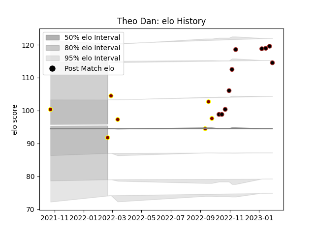

---  
layout: page  
title: Theo Dan  
date: 2023-02-02 18:41:56.235581  
categories: player  
---
# Theo Dan

## Positions: H

## Current elo: 92.0

## Current Percentile: 67.0

# Elo History

# Match History

| Team     |   Appearances |   Win Rate |
|:---------|--------------:|-----------:|
| Saracens |            10 |   0.9      |
| Ampthill |             7 |   0.357143 |

| Opponent            |   Matches |   Win Rate |
|:--------------------|----------:|-----------:|
| Bristol Rugby       |         2 |       1    |
| Ealing Trailfinders |         2 |       0    |
| Jersey              |         2 |       0.25 |
| Bath Rugby          |         1 |       1    |
| Coventry            |         1 |       0    |
| Edinburgh           |         1 |       0    |
| Exeter Chiefs       |         1 |       1    |
| Gloucester Rugby    |         1 |       1    |
| Hartpury College    |         1 |       1    |
| Lyon                |         1 |       1    |
| Newcastle Falcons   |         1 |       1    |
| Northampton Saints  |         1 |       1    |
| Richmond            |         1 |       1    |
| Sale Sharks         |         1 |       1    |