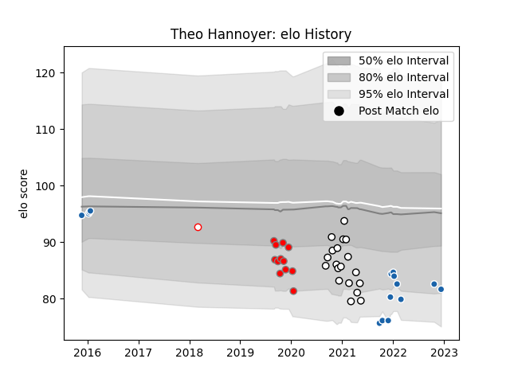

---  
layout: page  
title: Theo Hannoyer  
date: 2022-12-18 16:22:29.604935  
categories: player  
---
# Theo Hannoyer

## Positions: L

## Current elo: 86.0

## Current Percentile: 12.0

# Elo History

# Match History

| Team                       |   Appearances |   Win Rate |
|:---------------------------|--------------:|-----------:|
| Valence Romans Drome Rugby |            19 |   0.421053 |
| Castres Olympique          |            16 |   0.375    |
| Roval Drome XV             |            12 |   0.166667 |
| Dax                        |             1 |   0        |

| Opponent             |   Matches |   Win Rate |
|:---------------------|----------:|-----------:|
| Biarritz Olympique   |         4 |   0.5      |
| Montauban            |         3 |   0.333333 |
| Carcassonne          |         3 |   0.666667 |
| Soyaux-Angouleme     |         3 |   0.5      |
| Grenoble             |         3 |   0        |
| Rouen                |         3 |   0.333333 |
| Beziers              |         3 |   0.166667 |
| Oyonnax              |         2 |   0        |
| Colomiers            |         2 |   0.5      |
| Dragons              |         2 |   0.5      |
| Stade Francais Paris |         2 |   0.5      |
| Perpignan            |         2 |   0        |
| Pau                  |         2 |   1        |
| Toulon               |         1 |   0        |
| Racing 92            |         1 |   0        |
| Provence Rugby       |         1 |   0        |
| Aurillac             |         1 |   1        |
| Nevers               |         1 |   1        |
| Munster              |         1 |   0        |
| Montpellier Herault  |         1 |   0        |
| Mont-de-Marsan       |         1 |   0        |
| La Rochelle          |         1 |   1        |
| Harlequins           |         1 |   0        |
| Exeter Chiefs        |         1 |   0        |
| Edinburgh            |         1 |   0        |
| Bordeaux Begles      |         1 |   0        |
| Vannes               |         1 |   0        |