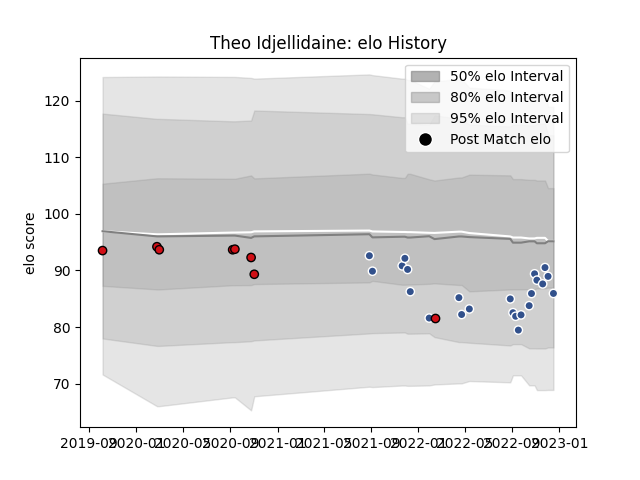

---  
layout: page  
title: Theo Idjellidaine  
date: 2023-01-13 11:27:54.154868  
categories: player  
---
# Theo Idjellidaine

## Positions: SH

## Current elo: 83.0

## Current Percentile: 21.0

# Elo History

# Match History

| Team             |   Appearances |   Win Rate |
|:-----------------|--------------:|-----------:|
| Agen             |            24 |   0.333333 |
| Stade Toulousain |             8 |   0.25     |

| Opponent             |   Matches |   Win Rate |
|:---------------------|----------:|-----------:|
| Rouen                |         3 |   0.666667 |
| Colomiers            |         3 |   0.333333 |
| Oyonnax              |         3 |   0        |
| Bayonne              |         2 |   0        |
| Stade Francais Paris |         2 |   0        |
| Provence Rugby       |         2 |   0.5      |
| Nevers               |         2 |   0        |
| Beziers              |         2 |   0        |
| Montauban            |         1 |   0        |
| Soyaux-Angouleme     |         1 |   0        |
| Montpellier Herault  |         1 |   1        |
| Massy                |         1 |   1        |
| Mont-de-Marsan       |         1 |   1        |
| Lyon                 |         1 |   0        |
| La Rochelle          |         1 |   1        |
| Grenoble             |         1 |   0        |
| Clermont Auvergne    |         1 |   0        |
| Carcassonne          |         1 |   0        |
| Brive                |         1 |   0        |
| Biarritz Olympique   |         1 |   1        |
| Vannes               |         1 |   1        |