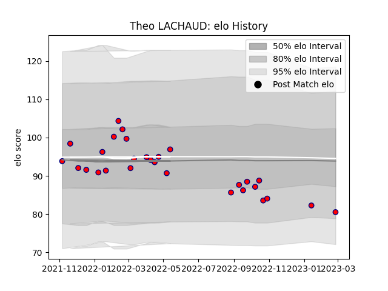

---  
layout: page  
title: Theo LACHAUD  
date: 2023-03-04 11:38:53.001924  
categories: player  
---
# Theo LACHAUD

## Positions: H

## Current elo: 80.0

## Current Percentile: 16.0

# Elo History

# Match History

| Team     |   Appearances |   Win Rate |
|:---------|--------------:|-----------:|
| Aurillac |            29 |    0.37931 |

| Opponent         |   Matches |   Win Rate |
|:-----------------|----------:|-----------:|
| Montauban        |         3 |   0.666667 |
| Mont-de-Marsan   |         3 |   0        |
| Beziers          |         3 |   0.666667 |
| Oyonnax          |         2 |   0.5      |
| Nevers           |         2 |   0.5      |
| Agen             |         2 |   0.5      |
| Grenoble         |         2 |   0        |
| Carcassonne      |         2 |   0        |
| Vannes           |         2 |   0        |
| Massy            |         1 |   1        |
| Bayonne          |         1 |   0        |
| Narbonne         |         1 |   1        |
| Colomiers        |         1 |   1        |
| Provence Rugby   |         1 |   0        |
| Rouen            |         1 |   0        |
| Soyaux-Angouleme |         1 |   1        |
| US Bressane      |         1 |   0        |