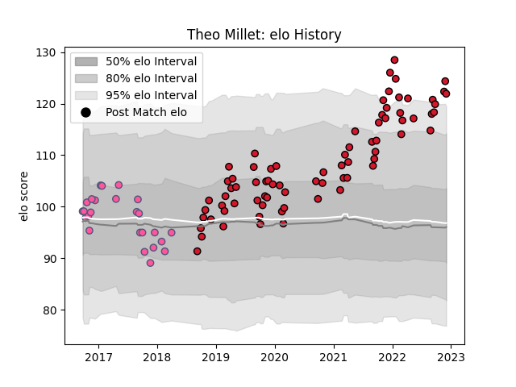

---  
layout: page  
title: Theo Millet  
date: 2023-02-02 18:59:36.619361  
categories: player  
---
# Theo Millet

## Positions: C

## Current elo: 88.0

## Current Percentile: 87.0

# Elo History

# Match History

| Team                 |   Appearances |   Win Rate |
|:---------------------|--------------:|-----------:|
| Oyonnax              |            99 |   0.651515 |
| Stade Francais Paris |            25 |   0.44     |

| Opponent                   |   Matches |   Win Rate |
|:---------------------------|----------:|-----------:|
| Beziers                    |         9 |   0.722222 |
| Mont-de-Marsan             |         8 |   0.4375   |
| Provence Rugby             |         8 |   0.75     |
| Nevers                     |         7 |   0.714286 |
| Colomiers                  |         7 |   0.571429 |
| Carcassonne                |         6 |   0.833333 |
| Montauban                  |         6 |   0.583333 |
| Vannes                     |         6 |   0.666667 |
| Biarritz Olympique         |         6 |   0.333333 |
| Grenoble                   |         5 |   0.6      |
| Soyaux-Angouleme           |         5 |   1        |
| Aurillac                   |         5 |   0.6      |
| Rouen                      |         4 |   0.5      |
| US Bressane                |         3 |   0.666667 |
| Bayonne                    |         3 |   0.666667 |
| Pau                        |         3 |   0.333333 |
| Brive                      |         2 |   0        |
| Toulon                     |         2 |   0        |
| Timisoara Saracens         |         2 |   1        |
| Stade Toulousain           |         2 |   0        |
| Perpignan                  |         2 |   0.5      |
| Agen                       |         2 |   1        |
| Montpellier Herault        |         2 |   0.5      |
| Bordeaux Begles            |         2 |   0        |
| Massy                      |         2 |   1        |
| Lyon                       |         2 |   0.5      |
| La Rochelle                |         2 |   1        |
| Krasny Yar                 |         2 |   0.5      |
| Harlequins                 |         2 |   0.5      |
| Narbonne                   |         1 |   1        |
| Oyonnax                    |         1 |   1        |
| Roval Drome XV             |         1 |   1        |
| London Irish               |         1 |   1        |
| Edinburgh                  |         1 |   0        |
| Valence Romans Drome Rugby |         1 |   1        |
| Castres Olympique          |         1 |   0        |