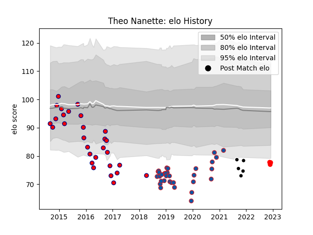

---  
layout: page  
title: Theo Nanette  
date: 2022-12-18 16:12:56.079739  
categories: player  
---
# Theo Nanette

## Positions: SH

## Current elo: 77.0

## Current Percentile: 4.0

# Elo History

# Match History

| Team           |   Appearances |   Win Rate |
|:---------------|--------------:|-----------:|
| Grenoble       |            33 |   0.378788 |
| Aurillac       |            29 |   0.362069 |
| Provence Rugby |             5 |   0.2      |
| Rouen          |             5 |   0.2      |

| Opponent             |   Matches |   Win Rate |
|:---------------------|----------:|-----------:|
| Agen                 |         5 |   0.3      |
| Montauban            |         5 |   0.7      |
| Perpignan            |         4 |   0.625    |
| Beziers              |         4 |   0.25     |
| Carcassonne          |         3 |   0        |
| Tarbes               |         3 |   0.666667 |
| Narbonne             |         3 |   0.333333 |
| Dax                  |         3 |   0        |
| Vannes               |         3 |   0.333333 |
| Aurillac             |         3 |   0.333333 |
| Benetton Treviso     |         2 |   0        |
| Biarritz Olympique   |         2 |   0        |
| Stade Toulousain     |         2 |   0        |
| Soyaux-Angouleme     |         2 |   0.5      |
| Provence Rugby       |         2 |   0.5      |
| Castres Olympique    |         2 |   0        |
| Montpellier Herault  |         2 |   0.5      |
| Lyon                 |         2 |   0        |
| Albi                 |         2 |   1        |
| Harlequins           |         2 |   0.5      |
| Bordeaux Begles      |         2 |   0.5      |
| Colomiers            |         2 |   0        |
| Mont-de-Marsan       |         1 |   0        |
| La Rochelle          |         1 |   0        |
| Oyonnax              |         1 |   1        |
| Pau                  |         1 |   0        |
| Bayonne              |         1 |   0        |
| Grenoble             |         1 |   0        |
| Racing 92            |         1 |   0        |
| Rouen                |         1 |   1        |
| Stade Francais Paris |         1 |   0        |
| Clermont Auvergne    |         1 |   0.5      |
| Toulon               |         1 |   1        |
| Bourgoin-Jallieu     |         1 |   1        |