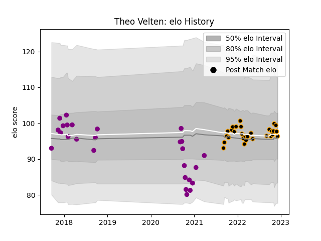

---  
layout: page  
title: Theo Velten  
date: 2023-01-17 11:33:11.176858  
categories: player  
---
# Theo Velten

## Positions: W, C

## Current elo: 94.0

## Current Percentile: 85.0

# Elo History

# Match History

| Team             |   Appearances |   Win Rate |
|:-----------------|--------------:|-----------:|
| Chambery         |            36 |   0.527778 |
| Soyaux-Angouleme |            30 |   0.366667 |

| Opponent                   |   Matches |   Win Rate |
|:---------------------------|----------:|-----------:|
| Beziers                    |         4 |   1        |
| Albi                       |         3 |   0        |
| Montauban                  |         3 |   0        |
| Valence Romans Drome Rugby |         3 |   0.333333 |
| Tarbes                     |         3 |   0.666667 |
| Blagnac                    |         3 |   0.333333 |
| Bourgoin-Jallieu           |         3 |   0.333333 |
| Suresnes                   |         3 |   0.666667 |
| Carcassonne                |         3 |   0.333333 |
| Cognac Saint Jean d'Angély |         3 |   0.666667 |
| Nice                       |         3 |   0.666667 |
| Soyaux-Angouleme           |         2 |   1        |
| Rouen                      |         2 |   0        |
| Provence Rugby             |         2 |   0.5      |
| Nevers                     |         2 |   0        |
| Narbonne                   |         2 |   1        |
| Massy                      |         2 |   0.5      |
| Aubenas                    |         2 |   0.5      |
| Grenoble                   |         2 |   0        |
| Dijon                      |         2 |   1        |
| Dax                        |         2 |   0.5      |
| Colomiers                  |         2 |   0        |
| Biarritz Olympique         |         2 |   0        |
| Aurillac                   |         2 |   1        |
| Oyonnax                    |         1 |   0        |
| Rennes                     |         1 |   1        |
| Carqueiranne-Hyères        |         1 |   0        |
| Brive                      |         1 |   0        |
| US Bressane                |         1 |   1        |
| Vannes                     |         1 |   0        |