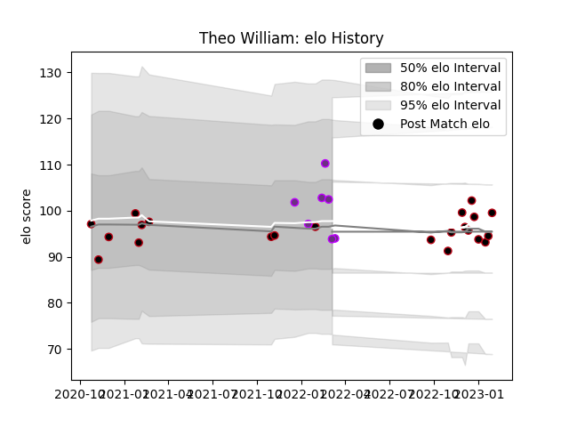

---  
layout: page  
title: Theo William  
date: 2023-01-06 00:10:22.714502  
categories: player  
---
# Theo William

## Positions: FL, L

## Current elo: 102.0

## Current Percentile: 65.0

# Elo History

# Match History

| Team        |   Appearances |   Win Rate |
|:------------|--------------:|-----------:|
| Lyon        |            19 |   0.526316 |
| US Bressane |             7 |   0.357143 |

| Opponent             |   Matches |   Win Rate |
|:---------------------|----------:|-----------:|
| Stade Toulousain     |         3 |        1   |
| Agen                 |         2 |        1   |
| Castres Olympique    |         2 |        1   |
| Stade Francais Paris |         2 |        1   |
| Perpignan            |         2 |        0.5 |
| Montpellier Herault  |         2 |        0.5 |
| Clermont Auvergne    |         1 |        0   |
| Grenoble             |         1 |        1   |
| Mont-de-Marsan       |         1 |        0   |
| Bayonne              |         1 |        0   |
| Narbonne             |         1 |        0   |
| Pau                  |         1 |        0   |
| Carcassonne          |         1 |        0   |
| Provence Rugby       |         1 |        0.5 |
| Saracens             |         1 |        0   |
| Bulls                |         1 |        0   |
| Brive                |         1 |        0   |
| Toulon               |         1 |        0   |
| Vannes               |         1 |        0   |