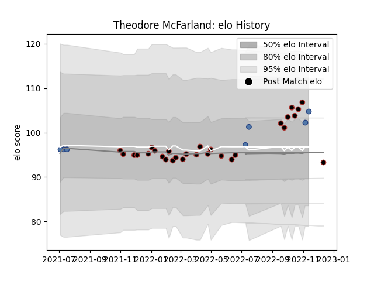

---  
layout: page  
title: Theodore McFarland  
date: 2022-11-16 11:35:22.563676  
categories: player  
---
# Theodore McFarland

## Positions: FL, L

## Country: Samoa

## Current elo: 101.0

## Current Percentile: 41.0

# Elo History

# Match History

| Team     |   Appearances |   Win Rate |
|:---------|--------------:|-----------:|
| Saracens |            28 |   0.803571 |
| Samoa    |             7 |   0.714286 |

| Opponent           |   Matches |   Win Rate |
|:-------------------|----------:|-----------:|
| Harlequins         |         4 |   1        |
| Leicester Tigers   |         3 |   0.666667 |
| London Irish       |         3 |   0.5      |
| Exeter Chiefs      |         3 |   0.666667 |
| Tonga              |         3 |   1        |
| Sale Sharks        |         3 |   1        |
| Northampton Saints |         2 |   1        |
| Newcastle Falcons  |         2 |   1        |
| Bath Rugby         |         2 |   1        |
| Gloucester Rugby   |         2 |   0.5      |
| Worcester Warriors |         2 |   1        |
| Brive              |         1 |   1        |
| New Zealand Maori  |         1 |   0        |
| Italy              |         1 |   0        |
| Georgia            |         1 |   1        |
| Fiji               |         1 |   1        |
| Wasps              |         1 |   0        |