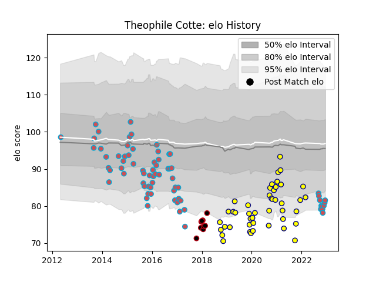

---  
layout: page  
title: Theophile Cotte  
date: 2022-11-22 11:39:09.809897  
categories: player  
---
# Theophile Cotte

## Positions: FL

## Current elo: 80.0

## Current Percentile: 4.0

# Elo History

# Match History

| Team             |   Appearances |   Win Rate |
|:-----------------|--------------:|-----------:|
| Bourgoin-Jallieu |            68 |   0.404412 |
| Nevers           |            45 |   0.544444 |
| Lyon             |             9 |   0.444444 |

| Opponent                   |   Matches |   Win Rate |
|:---------------------------|----------:|-----------:|
| Colomiers                  |         9 |   0.333333 |
| Carcassonne                |         8 |   0.5      |
| Oyonnax                    |         7 |   0.142857 |
| Albi                       |         7 |   0.285714 |
| Agen                       |         6 |   0.666667 |
| Provence Rugby             |         6 |   0.5      |
| Montauban                  |         6 |   0.666667 |
| Mont-de-Marsan             |         6 |   0.666667 |
| Dax                        |         5 |   0.5      |
| Perpignan                  |         5 |   0.2      |
| Beziers                    |         5 |   0.8      |
| Biarritz Olympique         |         5 |   0.2      |
| Narbonne                   |         5 |   0.6      |
| Vannes                     |         4 |   0.25     |
| Aurillac                   |         4 |   1        |
| Lyon                       |         3 |   0        |
| Soyaux-Angouleme           |         3 |   0.666667 |
| Rouen                      |         3 |   0.666667 |
| Bayonne                    |         3 |   0        |
| La Rochelle                |         2 |   0        |
| Valence Romans Drome Rugby |         2 |   0.75     |
| US Bressane                |         2 |   0.5      |
| Tarbes                     |         2 |   0.5      |
| Massy                      |         2 |   1        |
| Cardiff Blues              |         2 |   0        |
| Pau                        |         1 |   1        |
| Auch                       |         1 |   0        |
| Sale Sharks                |         1 |   0        |
| Montpellier Herault        |         1 |   0        |
| Stade Toulousain           |         1 |   1        |
| Suresnes                   |         1 |   0        |
| Carqueiranne-Hyères        |         1 |   1        |
| Chambery                   |         1 |   1        |
| Clermont Auvergne          |         1 |   1        |
| Grenoble                   |         1 |   0        |