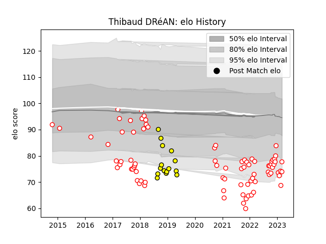

---  
layout: page  
title: Thibaud DRéAN  
date: 2023-03-06 11:24:31.630121  
categories: player  
---
# Thibaud DRéAN

## Positions: P

## Current elo: 72.0

## Current Percentile: 3.0

# Elo History

# Match History

| Team        |   Appearances |   Win Rate |
|:------------|--------------:|-----------:|
| Dax         |            81 |   0.493827 |
| Carcassonne |            15 |   0.4      |

| Opponent                   |   Matches |   Win Rate |
|:---------------------------|----------:|-----------:|
| Blagnac                    |         6 |   0.5      |
| Albi                       |         6 |   0.166667 |
| Aurillac                   |         5 |   0.4      |
| Bourgoin-Jallieu           |         5 |   0.6      |
| Soyaux-Angouleme           |         5 |   0.6      |
| Narbonne                   |         4 |   0.75     |
| Beziers                    |         4 |   0.25     |
| Tarbes                     |         4 |   0.75     |
| Suresnes                   |         4 |   0.75     |
| Colomiers                  |         4 |   0.25     |
| Vannes                     |         3 |   0.666667 |
| Dijon                      |         3 |   1        |
| Nice                       |         3 |   1        |
| Montauban                  |         3 |   0        |
| Massy                      |         3 |   0.333333 |
| Cognac Saint Jean d'Angély |         3 |   0.666667 |
| Chambery                   |         3 |   0.666667 |
| Carcassonne                |         3 |   0.333333 |
| Valence Romans Drome Rugby |         3 |   0.666667 |
| US Bressane                |         2 |   1        |
| Biarritz Olympique         |         2 |   0        |
| Bayonne                    |         2 |   0.5      |
| Nevers                     |         2 |   0.5      |
| Oyonnax                    |         2 |   0        |
| Perpignan                  |         2 |   0        |
| Provence Rugby             |         2 |   0.5      |
| Rennes                     |         1 |   1        |
| Agen                       |         1 |   0        |
| Mont-de-Marsan             |         1 |   0        |
| Grenoble                   |         1 |   0        |
| Carqueiranne-Hyères        |         1 |   1        |
| Brive                      |         1 |   0        |
| Aubenas                    |         1 |   0        |
| Lyon                       |         1 |   0        |