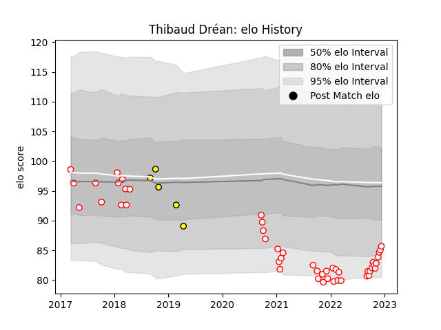

---  
layout: page  
title: Thibaud Dréan  
date: 2022-12-09 13:12:27.856991  
categories: player  
---
# Thibaud Dréan

## Positions: P

## Current elo: 85.0

## Current Percentile: 10.0

# Elo History

# Match History

| Team        |   Appearances |   Win Rate |
|:------------|--------------:|-----------:|
| Dax         |            46 |   0.565217 |
| Carcassonne |             5 |   0        |

| Opponent                   |   Matches |   Win Rate |
|:---------------------------|----------:|-----------:|
| Albi                       |         5 |   0.2      |
| Blagnac                    |         4 |   0.5      |
| Tarbes                     |         4 |   0.75     |
| Aurillac                   |         3 |   0        |
| Soyaux-Angouleme           |         3 |   0.666667 |
| Chambery                   |         3 |   0.666667 |
| Dijon                      |         3 |   1        |
| Narbonne                   |         2 |   0.5      |
| Valence Romans Drome Rugby |         2 |   0.5      |
| Suresnes                   |         2 |   1        |
| Oyonnax                    |         2 |   0        |
| Nice                       |         2 |   1        |
| Vannes                     |         2 |   0.5      |
| Cognac Saint Jean d'Angély |         2 |   0.5      |
| Bourgoin-Jallieu           |         2 |   0.5      |
| Nevers                     |         1 |   0        |
| Massy                      |         1 |   1        |
| Perpignan                  |         1 |   0        |
| Provence Rugby             |         1 |   0        |
| Rennes                     |         1 |   1        |
| Carqueiranne-Hyères        |         1 |   1        |
| Brive                      |         1 |   0        |
| US Bressane                |         1 |   1        |
| Beziers                    |         1 |   0        |
| Agen                       |         1 |   0        |