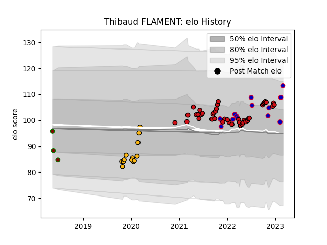

---  
layout: page  
title: Thibaud FLAMENT  
date: 2023-03-16 19:50:51.158963  
categories: player  
---
# Thibaud FLAMENT

## Positions: L, FL

## Country: France

## Current elo: 120.0

## Current Percentile: 88.0

# Elo History

# Match History

| Team             |   Appearances |   Win Rate |
|:-----------------|--------------:|-----------:|
| Stade Toulousain |            41 |   0.743902 |
| France           |            15 |   0.933333 |
| Wasps            |            13 |   0.538462 |
| Newman           |             3 |   0.333333 |

| Opponent            |   Matches |   Win Rate |
|:--------------------|----------:|-----------:|
| La Rochelle         |         7 |   1        |
| Castres Olympique   |         5 |   0.4      |
| Brive               |         4 |   1        |
| Clermont Auvergne   |         4 |   0.75     |
| Agen                |         3 |   1        |
| Bordeaux Begles     |         3 |   0.666667 |
| Toulon              |         3 |   0.333333 |
| Ireland             |         2 |   0.5      |
| Munster             |         2 |   0.75     |
| Montpellier Herault |         2 |   1        |
| Lyon                |         2 |   0.5      |
| London Irish        |         2 |   0.5      |
| Sale Sharks         |         2 |   0.5      |
| Japan               |         2 |   1        |
| Scotland            |         2 |   1        |
| Gloucester Rugby    |         2 |   0.5      |
| England             |         2 |   1        |
| Biarritz Olympique  |         2 |   1        |
| Saracens            |         1 |   1        |
| Perpignan           |         1 |   0        |
| South Africa        |         1 |   1        |
| Ulster              |         1 |   0        |
| Wales               |         1 |   1        |
| Wasps               |         1 |   0        |
| SIC                 |         1 |   0        |
| Racing 92           |         1 |   1        |
| Leicester Tigers    |         1 |   0        |
| Pau                 |         1 |   1        |
| Northampton Saints  |         1 |   0        |
| New Zealand         |         1 |   1        |
| Alumni              |         1 |   0        |
| Italy               |         1 |   1        |
| Georgia             |         1 |   1        |
| Cardiff Blues       |         1 |   1        |
| CUBA                |         1 |   1        |
| Bath Rugby          |         1 |   1        |
| Australia           |         1 |   1        |
| Argentina           |         1 |   1        |
| Worcester Warriors  |         1 |   1        |