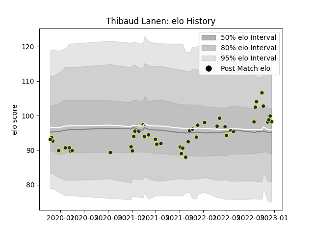

---  
layout: page  
title: Thibaud Lanen  
date: 2022-12-18 16:31:24.366681  
categories: player  
---
# Thibaud Lanen

## Positions: L, FL

## Current elo: 98.0

## Current Percentile: 61.0

# Elo History

# Match History

| Team              |   Appearances |   Win Rate |
|:------------------|--------------:|-----------:|
| Clermont Auvergne |            45 |   0.522222 |

| Opponent             |   Matches |   Win Rate |
|:---------------------|----------:|-----------:|
| Toulon               |         5 |   0.2      |
| Racing 92            |         5 |   0.2      |
| Montpellier Herault  |         4 |   0.75     |
| Lyon                 |         3 |   0.666667 |
| Bordeaux Begles      |         3 |   0.5      |
| Castres Olympique    |         3 |   0        |
| Stade Francais Paris |         3 |   1        |
| Pau                  |         3 |   1        |
| Stade Toulousain     |         2 |   0        |
| Agen                 |         2 |   1        |
| Bayonne              |         2 |   0        |
| La Rochelle          |         2 |   1        |
| Biarritz Olympique   |         2 |   1        |
| Leicester Tigers     |         1 |   0        |
| Perpignan            |         1 |   0        |
| Harlequins           |         1 |   1        |
| Brive                |         1 |   1        |
| Stormers             |         1 |   1        |
| Ulster               |         1 |   0        |