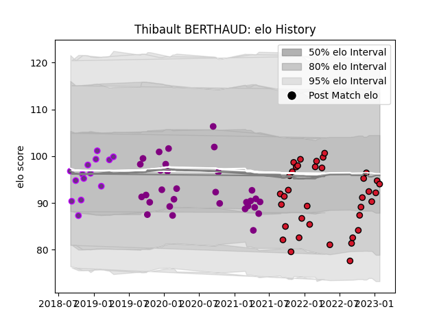

---  
layout: page  
title: Thibault BERTHAUD  
date: 2023-03-30 11:30:59.303853  
categories: player  
---
# Thibault BERTHAUD

Last updated: 2023-03-30
## Positions: P

## Current elo: 96.0

## Current Percentile: 57.0

# Elo History

# Match History

| Team             |   Appearances |   Win Rate |
|:-----------------|--------------:|-----------:|
| Oyonnax          |            42 |   0.761905 |
| Soyaux-Angouleme |            31 |   0.483871 |
| US Bressane      |            14 |   0.285714 |

| Opponent           |   Matches |   Win Rate |
|:-------------------|----------:|-----------:|
| Montauban          |         8 |   0.5625   |
| Colomiers          |         8 |   0.625    |
| Rouen              |         7 |   0.571429 |
| Vannes             |         7 |   0.428571 |
| Beziers            |         7 |   0.785714 |
| Carcassonne        |         6 |   0.75     |
| Provence Rugby     |         6 |   0.75     |
| Biarritz Olympique |         5 |   0.2      |
| Aurillac           |         5 |   0.4      |
| Grenoble           |         4 |   0.75     |
| Nevers             |         3 |   0.333333 |
| Mont-de-Marsan     |         3 |   0.666667 |
| Agen               |         3 |   1        |
| Oyonnax            |         2 |   0        |
| Perpignan          |         2 |   0        |
| Massy              |         2 |   1        |
| Bayonne            |         2 |   0.5      |
| Soyaux-Angouleme   |         2 |   0.5      |
| US Bressane        |         2 |   1        |
| Narbonne           |         1 |   1        |
| Brive              |         1 |   0        |
| Roval Drome XV     |         1 |   1        |