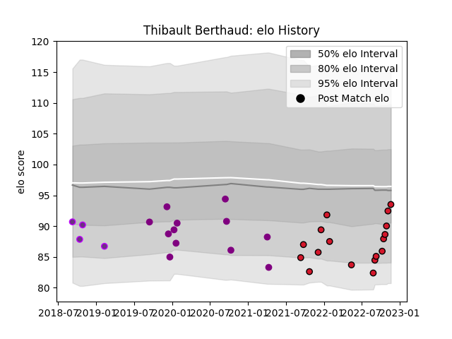

---  
layout: page  
title: Thibault Berthaud  
date: 2022-12-18 16:35:00.574753  
categories: player  
---
# Thibault Berthaud

## Positions: P

## Current elo: 92.0

## Current Percentile: 29.0

# Elo History

# Match History

| Team             |   Appearances |   Win Rate |
|:-----------------|--------------:|-----------:|
| Oyonnax          |            19 |   0.710526 |
| Soyaux-Angouleme |            12 |   0.458333 |
| US Bressane      |             4 |   0.25     |

| Opponent           |   Matches |   Win Rate |
|:-------------------|----------:|-----------:|
| Colomiers          |         4 |   0.75     |
| Montauban          |         3 |   0.333333 |
| Carcassonne        |         3 |   0.833333 |
| Rouen              |         3 |   0.333333 |
| Vannes             |         3 |   0.666667 |
| Biarritz Olympique |         2 |   0        |
| Grenoble           |         2 |   0.5      |
| Aurillac           |         2 |   0.5      |
| Provence Rugby     |         2 |   0.75     |
| Beziers            |         2 |   1        |
| Soyaux-Angouleme   |         2 |   0.5      |
| Massy              |         1 |   1        |
| Mont-de-Marsan     |         1 |   1        |
| Narbonne           |         1 |   1        |
| Nevers             |         1 |   0        |
| Oyonnax            |         1 |   0        |
| Perpignan          |         1 |   0        |
| Agen               |         1 |   1        |