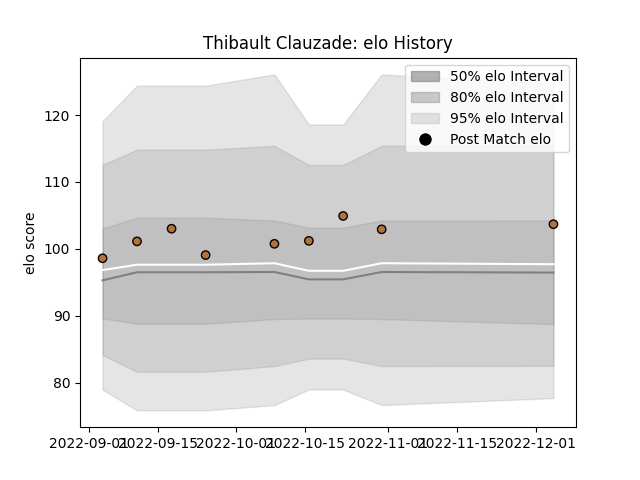

---  
layout: page  
title: Thibault Clauzade  
date: 2022-12-09 13:23:39.720125  
categories: player  
---
# Thibault Clauzade

## Positions: N8, FL

## Current elo: 104.0

## Current Percentile: 71.0

# Elo History

# Match History

| Team     |   Appearances |   Win Rate |
|:---------|--------------:|-----------:|
| Narbonne |             9 |   0.444444 |

| Opponent                   |   Matches |   Win Rate |
|:---------------------------|----------:|-----------:|
| Albi                       |         1 |          0 |
| Bourgoin-Jallieu           |         1 |          0 |
| Carqueiranne-Hyères        |         1 |          1 |
| Chambery                   |         1 |          0 |
| Nice                       |         1 |          1 |
| Suresnes                   |         1 |          1 |
| Tarbes                     |         1 |          0 |
| US Bressane                |         1 |          1 |
| Valence Romans Drome Rugby |         1 |          0 |