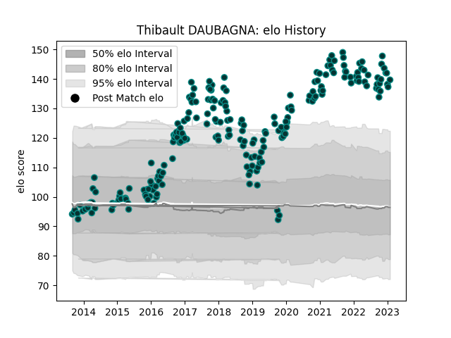

---  
layout: page  
title: Thibault DAUBAGNA  
date: 2023-01-30 18:32:30.894793  
categories: player  
---
# Thibault DAUBAGNA

## Positions: SH

## Current elo: 140.0

## Current Percentile: 99.0

# Elo History

# Match History

| Team   |   Appearances |   Win Rate |
|:-------|--------------:|-----------:|
| Pau    |           221 |   0.463801 |

| Opponent             |   Matches |   Win Rate |
|:---------------------|----------:|-----------:|
| La Rochelle          |        16 |   0.1875   |
| Castres Olympique    |        16 |   0.3125   |
| Toulon               |        14 |   0.178571 |
| Montpellier Herault  |        14 |   0.428571 |
| Racing 92            |        14 |   0.25     |
| Stade Francais Paris |        13 |   0.384615 |
| Bordeaux Begles      |        13 |   0.461538 |
| Lyon                 |        12 |   0.375    |
| Clermont Auvergne    |        12 |   0.25     |
| Agen                 |        11 |   0.727273 |
| Stade Toulousain     |        11 |   0.272727 |
| Brive                |         9 |   0.555556 |
| Perpignan            |         7 |   0.857143 |
| Bayonne              |         6 |   0.833333 |
| Colomiers            |         4 |   0.75     |
| Grenoble             |         4 |   1        |
| Oyonnax              |         4 |   0.75     |
| Cardiff Blues        |         3 |   0.333333 |
| Biarritz Olympique   |         3 |   1        |
| Mont-de-Marsan       |         3 |   0.666667 |
| Albi                 |         3 |   0.666667 |
| Leicester Tigers     |         2 |   0.5      |
| Narbonne             |         2 |   1        |
| Gloucester Rugby     |         2 |   1        |
| Bourgoin-Jallieu     |         2 |   0.5      |
| Dax                  |         2 |   1        |
| Carcassonne          |         2 |   0.5      |
| Calvisano            |         2 |   1        |
| Bristol Rugby        |         2 |   0        |
| Bath Rugby           |         2 |   0        |
| Aurillac             |         1 |   1        |
| Worcester Warriors   |         1 |   1        |
| US Bressane          |         1 |   1        |
| Auch                 |         1 |   1        |
| Tarbes               |         1 |   1        |
| Dragons              |         1 |   0        |
| Sale Sharks          |         1 |   0        |
| Massy                |         1 |   1        |
| Ospreys              |         1 |   1        |
| Cheetahs             |         1 |   0        |
| Zebre                |         1 |   1        |