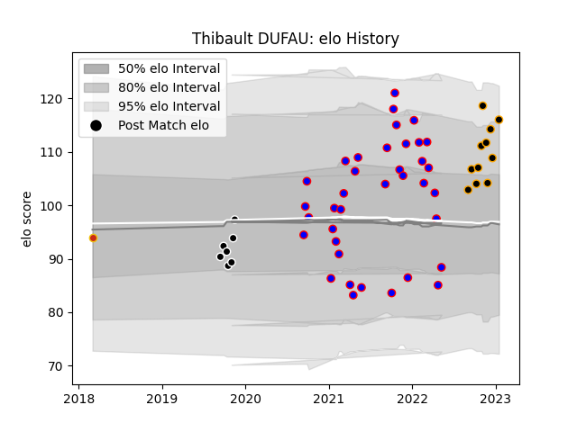

---  
layout: page  
title: Thibault DUFAU  
date: 2023-01-25 18:58:08.137361  
categories: player  
---
# Thibault DUFAU

## Positions: SH

## Current elo: 121.0

## Current Percentile: 90.0

# Elo History

# Match History

| Team           |   Appearances |   Win Rate |
|:---------------|--------------:|-----------:|
| Dijon          |            37 |   0.324324 |
| Chambery       |            12 |   0.5      |
| Provence Rugby |             7 |   0.428571 |
| Perpignan      |             1 |   0        |

| Opponent                   |   Matches |   Win Rate |
|:---------------------------|----------:|-----------:|
| Tarbes                     |         5 |   0.5      |
| Bourgoin-Jallieu           |         4 |   0        |
| Cognac Saint Jean d'Angély |         4 |   0        |
| Suresnes                   |         4 |   0.25     |
| Dax                        |         4 |   0        |
| Nice                       |         4 |   0.5      |
| Albi                       |         3 |   0        |
| Valence Romans Drome Rugby |         3 |   0.666667 |
| US Bressane                |         3 |   0.333333 |
| Blagnac                    |         3 |   0.666667 |
| Chambery                   |         3 |   0.666667 |
| Nevers                     |         2 |   0.5      |
| Soyaux-Angouleme           |         2 |   0.5      |
| Massy                      |         2 |   0.5      |
| Narbonne                   |         2 |   0.5      |
| Aubenas                    |         2 |   0.75     |
| Oyonnax                    |         1 |   0        |
| Rennes                     |         1 |   1        |
| Colomiers                  |         1 |   1        |
| Carcassonne                |         1 |   0        |
| Beziers                    |         1 |   0        |
| Aurillac                   |         1 |   0        |
| Vannes                     |         1 |   1        |