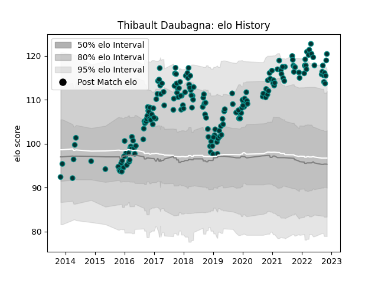

---  
layout: page  
title: Thibault Daubagna  
date: 2022-11-15 23:40:57.405702  
categories: player  
---
# Thibault Daubagna

## Positions: SH

## Current elo: 120.0

## Current Percentile: 96.0

# Elo History

# Match History

| Team   |   Appearances |   Win Rate |
|:-------|--------------:|-----------:|
| Pau    |           189 |   0.439153 |

| Opponent             |   Matches |   Win Rate |
|:---------------------|----------:|-----------:|
| Castres Olympique    |        15 |   0.266667 |
| Montpellier Herault  |        14 |   0.428571 |
| La Rochelle          |        14 |   0.214286 |
| Toulon               |        13 |   0.192308 |
| Bordeaux Begles      |        13 |   0.461538 |
| Racing 92            |        13 |   0.269231 |
| Stade Francais Paris |        12 |   0.416667 |
| Clermont Auvergne    |        12 |   0.25     |
| Lyon                 |        11 |   0.409091 |
| Agen                 |        10 |   0.8      |
| Stade Toulousain     |        10 |   0.3      |
| Brive                |         8 |   0.5      |
| Bayonne              |         5 |   0.9      |
| Perpignan            |         5 |   1        |
| Grenoble             |         4 |   1        |
| Oyonnax              |         4 |   0.75     |
| Cardiff Blues        |         3 |   0.333333 |
| Calvisano            |         2 |   1        |
| Bristol Rugby        |         2 |   0        |
| Colomiers            |         2 |   0.5      |
| Albi                 |         2 |   0.5      |
| Gloucester Rugby     |         2 |   1        |
| Leicester Tigers     |         2 |   0.5      |
| Bath Rugby           |         2 |   0        |
| Worcester Warriors   |         1 |   1        |
| Sale Sharks          |         1 |   0        |
| Dragons              |         1 |   0        |
| Ospreys              |         1 |   1        |
| Carcassonne          |         1 |   1        |
| Bourgoin-Jallieu     |         1 |   0        |
| Biarritz Olympique   |         1 |   1        |
| Aurillac             |         1 |   1        |
| Zebre                |         1 |   1        |