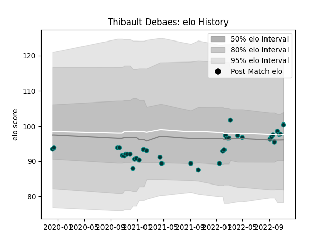

---  
layout: page  
title: Thibault Debaes  
date: 2022-12-18 16:18:03.348640  
categories: player  
---
# Thibault Debaes

## Positions: FH

## Current elo: 100.0

## Current Percentile: 45.0

# Elo History

# Match History

| Team   |   Appearances |   Win Rate |
|:-------|--------------:|-----------:|
| Pau    |            38 |   0.328947 |

| Opponent             |   Matches |   Win Rate |
|:---------------------|----------:|-----------:|
| Stade Toulousain     |         5 |   0.4      |
| Clermont Auvergne    |         4 |   0.25     |
| Racing 92            |         4 |   0        |
| Stade Francais Paris |         3 |   0.333333 |
| Lyon                 |         3 |   0.5      |
| La Rochelle          |         2 |   0        |
| Montpellier Herault  |         2 |   0        |
| Brive                |         2 |   0        |
| Cardiff Blues        |         2 |   0.5      |
| Bordeaux Begles      |         2 |   1        |
| Toulon               |         1 |   0        |
| Perpignan            |         1 |   1        |
| Bayonne              |         1 |   1        |
| London Irish         |         1 |   0        |
| Edinburgh            |         1 |   0        |
| Dragons              |         1 |   1        |
| Cheetahs             |         1 |   0        |
| Castres Olympique    |         1 |   0        |
| Worcester Warriors   |         1 |   1        |