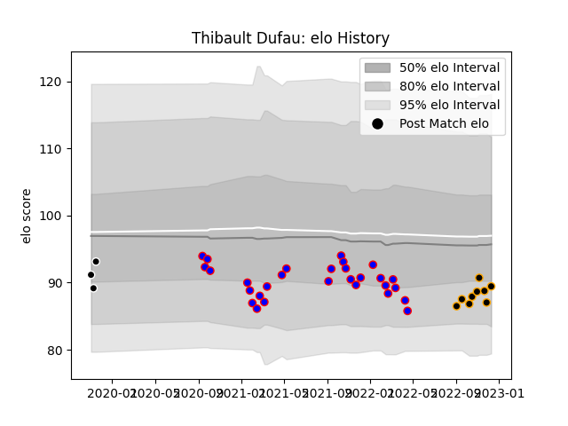

---  
layout: page  
title: Thibault Dufau  
date: 2022-12-14 11:34:41.214398  
categories: player  
---
# Thibault Dufau

## Positions: SH

## Current elo: 89.0

## Current Percentile: 16.0

# Elo History

# Match History

| Team           |   Appearances |   Win Rate |
|:---------------|--------------:|-----------:|
| Dijon          |            29 |   0.275862 |
| Chambery       |             9 |   0.555556 |
| Provence Rugby |             3 |   0.333333 |

| Opponent                   |   Matches |   Win Rate |
|:---------------------------|----------:|-----------:|
| Bourgoin-Jallieu           |         4 |   0        |
| Suresnes                   |         4 |   0.25     |
| Cognac Saint Jean d'Angély |         4 |   0        |
| Dax                        |         3 |   0        |
| Nice                       |         3 |   0.666667 |
| Albi                       |         2 |   0        |
| Narbonne                   |         2 |   0.5      |
| US Bressane                |         2 |   0        |
| Tarbes                     |         2 |   0.75     |
| Soyaux-Angouleme           |         2 |   0.5      |
| Massy                      |         2 |   0.5      |
| Aubenas                    |         2 |   0.75     |
| Chambery                   |         2 |   0.5      |
| Blagnac                    |         2 |   0.5      |
| Nevers                     |         1 |   1        |
| Rennes                     |         1 |   1        |
| Carcassonne                |         1 |   0        |
| Aurillac                   |         1 |   0        |
| Valence Romans Drome Rugby |         1 |   1        |