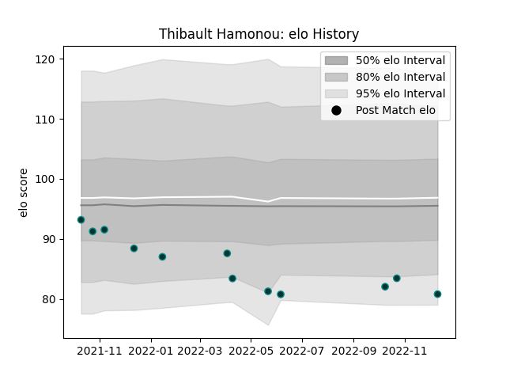

---  
layout: page  
title: Thibault Hamonou  
date: 2022-12-14 11:36:06.812250  
categories: player  
---
# Thibault Hamonou

## Positions: FL, L

## Current elo: 81.0

## Current Percentile: 8.0

# Elo History

# Match History

| Team   |   Appearances |   Win Rate |
|:-------|--------------:|-----------:|
| Pau    |            12 |   0.166667 |

| Opponent           |   Matches |   Win Rate |
|:-------------------|----------:|-----------:|
| Biarritz Olympique |         2 |          1 |
| Brive              |         1 |          0 |
| Castres Olympique  |         1 |          0 |
| Cheetahs           |         1 |          0 |
| Clermont Auvergne  |         1 |          0 |
| Edinburgh          |         1 |          0 |
| London Irish       |         1 |          0 |
| Lyon               |         1 |          0 |
| Racing 92          |         1 |          0 |
| Stade Toulousain   |         1 |          0 |
| Toulon             |         1 |          0 |