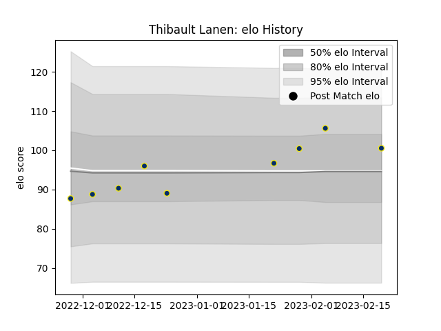

---  
layout: page  
title: Thibault Lanen  
date: 2023-02-24 02:30:27.018023  
categories: player  
---
# Thibault Lanen

## Positions: L

## Current elo: 101.0

## Current Percentile: 77.0

# Elo History

# Match History

| Team              |   Appearances |   Win Rate |
|:------------------|--------------:|-----------:|
| Clermont Auvergne |             9 |   0.333333 |

| Opponent            |   Matches |   Win Rate |
|:--------------------|----------:|-----------:|
| Stormers            |         2 |        0.5 |
| Bordeaux Begles     |         1 |        0   |
| Brive               |         1 |        0   |
| Castres Olympique   |         1 |        1   |
| Leicester Tigers    |         1 |        0   |
| Lyon                |         1 |        0   |
| Montpellier Herault |         1 |        1   |
| Racing 92           |         1 |        0   |