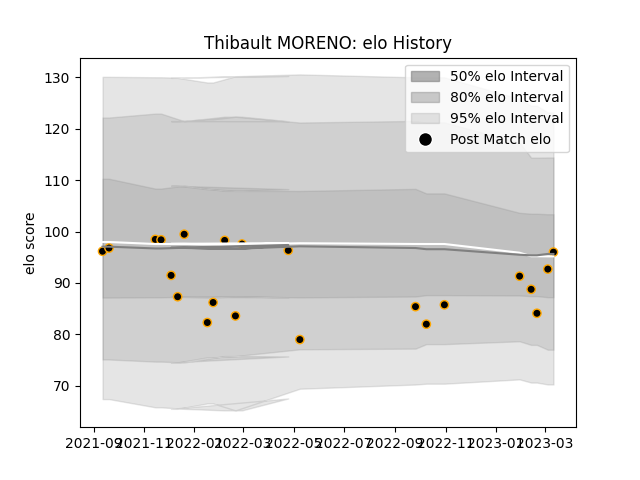

---  
layout: page  
title: Thibault MORENO  
date: 2023-02-08 11:09:57.801436  
categories: player  
---
# Thibault MORENO

## Positions: FH

## Current elo: 95.0

## Current Percentile: 27.0

# Elo History

# Match History

| Team     |   Appearances |   Win Rate |
|:---------|--------------:|-----------:|
| Chambery |            18 |   0.555556 |

| Opponent                   |   Matches |   Win Rate |
|:---------------------------|----------:|-----------:|
| Cognac Saint Jean d'Angély |         4 |       0.75 |
| Aubenas                    |         2 |       0.5  |
| Blagnac                    |         2 |       0    |
| Nice                       |         2 |       0.5  |
| Suresnes                   |         2 |       1    |
| Albi                       |         1 |       0    |
| Dax                        |         1 |       0    |
| Dijon                      |         1 |       1    |
| Massy                      |         1 |       0    |
| Narbonne                   |         1 |       1    |
| Tarbes                     |         1 |       1    |