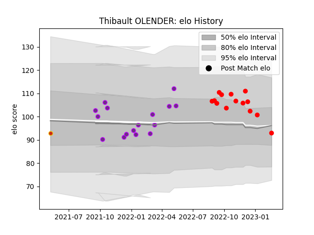

---  
layout: page  
title: Thibault OLENDER  
date: 2023-02-24 02:27:54.447142  
categories: player  
---
# Thibault OLENDER

## Positions: FH

## Current elo: 93.0

## Current Percentile: 71.0

# Elo History

# Match History

| Team        |   Appearances |   Win Rate |
|:------------|--------------:|-----------:|
| US Bressane |            16 |   0.4375   |
| Rouen       |            14 |   0.357143 |
| Perpignan   |             1 |   0        |

| Opponent           |   Matches |   Win Rate |
|:-------------------|----------:|-----------:|
| Agen               |         3 |   0.333333 |
| Provence Rugby     |         3 |   0.166667 |
| Colomiers          |         3 |   0.666667 |
| Grenoble           |         3 |   0.333333 |
| Aurillac           |         2 |   0        |
| Rouen              |         2 |   0.5      |
| Narbonne           |         2 |   0.5      |
| Montauban          |         2 |   0.75     |
| Vannes             |         2 |   0.5      |
| Beziers            |         2 |   0.5      |
| Massy              |         1 |   1        |
| Carcassonne        |         1 |   0        |
| Nevers             |         1 |   0        |
| Oyonnax            |         1 |   0        |
| Biarritz Olympique |         1 |   0        |
| Soyaux-Angouleme   |         1 |   1        |
| Mont-de-Marsan     |         1 |   0        |