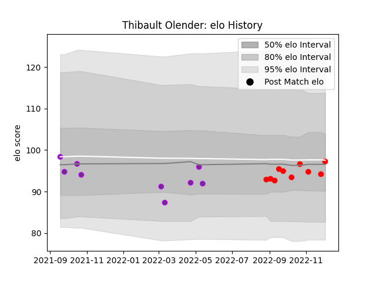

---  
layout: page  
title: Thibault Olender  
date: 2022-12-14 11:36:48.559024  
categories: player  
---
# Thibault Olender

## Positions: FH

## Current elo: 99.0

## Current Percentile: 52.0

# Elo History

# Match History

| Team        |   Appearances |   Win Rate |
|:------------|--------------:|-----------:|
| Rouen       |            11 |   0.454545 |
| US Bressane |             9 |   0.444444 |

| Opponent         |   Matches |   Win Rate |
|:-----------------|----------:|-----------:|
| Agen             |         2 |        0.5 |
| Beziers          |         2 |        0.5 |
| Colomiers        |         2 |        1   |
| Grenoble         |         2 |        0   |
| Narbonne         |         2 |        0.5 |
| Provence Rugby   |         2 |        0   |
| Carcassonne      |         1 |        0   |
| Massy            |         1 |        1   |
| Mont-de-Marsan   |         1 |        0   |
| Montauban        |         1 |        1   |
| Nevers           |         1 |        0   |
| Oyonnax          |         1 |        0   |
| Soyaux-Angouleme |         1 |        1   |
| Vannes           |         1 |        1   |