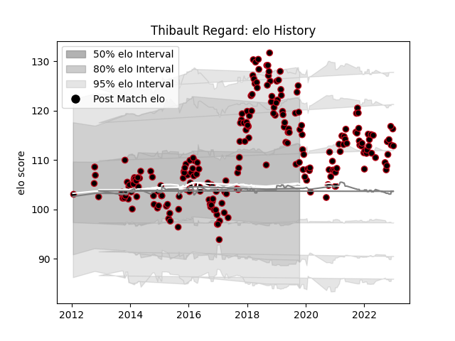

---  
layout: page  
title: Thibault Regard  
date: 2022-12-12 15:19:05.977215  
categories: player  
---
# Thibault Regard

## Positions: C, W

## Current elo: 99.0

## Current Percentile: 71.0

# Elo History

# Match History

| Team   |   Appearances |   Win Rate |
|:-------|--------------:|-----------:|
| Lyon   |           196 |   0.566327 |

| Opponent             |   Matches |   Win Rate |
|:---------------------|----------:|-----------:|
| Bordeaux Begles      |        15 |   0.4      |
| Montpellier Herault  |        13 |   0.538462 |
| Racing 92            |        12 |   0.5      |
| Toulon               |        12 |   0.375    |
| La Rochelle          |        12 |   0.458333 |
| Castres Olympique    |        12 |   0.333333 |
| Stade Francais Paris |        10 |   0.7      |
| Brive                |        10 |   0.6      |
| Clermont Auvergne    |         9 |   0.333333 |
| Stade Toulousain     |         9 |   0.666667 |
| Pau                  |         8 |   0.8125   |
| Bayonne              |         6 |   0.75     |
| Grenoble             |         5 |   0.8      |
| Perpignan            |         5 |   0.8      |
| Agen                 |         5 |   0.8      |
| Carcassonne          |         3 |   1        |
| Oyonnax              |         3 |   0.333333 |
| Biarritz Olympique   |         3 |   1        |
| Tarbes               |         3 |   0.333333 |
| Albi                 |         3 |   1        |
| Provence Rugby       |         2 |   1        |
| Sale Sharks          |         2 |   0.5      |
| Ospreys              |         2 |   0        |
| Newcastle Falcons    |         2 |   0.5      |
| Narbonne             |         2 |   0.5      |
| Leinster             |         2 |   0        |
| Mont-de-Marsan       |         2 |   1        |
| London Welsh         |         2 |   1        |
| Edinburgh            |         2 |   0.5      |
| Dax                  |         2 |   1        |
| Colomiers            |         2 |   0.5      |
| Cardiff Blues        |         2 |   0        |
| Bourgoin-Jallieu     |         2 |   1        |
| Beziers              |         2 |   1        |
| Aurillac             |         2 |   0.5      |
| Auch                 |         2 |   0.5      |
| Montauban            |         1 |   1        |
| Northampton Saints   |         1 |   0        |
| Glasgow Warriors     |         1 |   0        |
| Saracens             |         1 |   0        |
| Benetton Treviso     |         1 |   1        |
| US Bressane          |         1 |   1        |