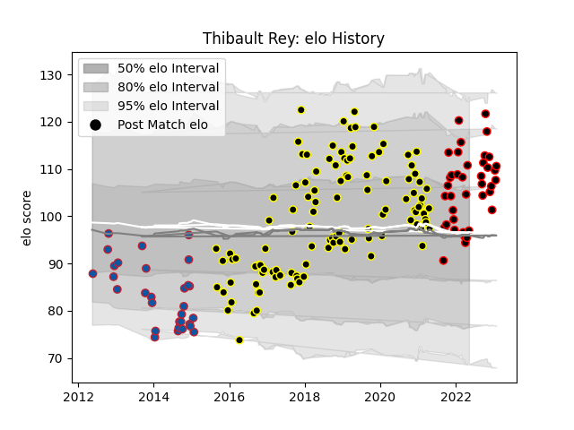

---  
layout: page  
title: Thibault Rey  
date: 2023-02-03 18:18:01.272630  
categories: player  
---
# Thibault Rey

## Positions: L

## Current elo: 97.0

## Current Percentile: 82.0

# Elo History

# Match History

| Team           |   Appearances |   Win Rate |
|:---------------|--------------:|-----------:|
| Mont-de-Marsan |           113 |   0.5      |
| Nice           |            39 |   0.474359 |
| Grenoble       |            30 |   0.516667 |

| Opponent                   |   Matches |   Win Rate |
|:---------------------------|----------:|-----------:|
| Colomiers                  |         9 |   0.388889 |
| Perpignan                  |         8 |   0.375    |
| Narbonne                   |         8 |   0.375    |
| Vannes                     |         8 |   0.5      |
| Aurillac                   |         8 |   0.5      |
| Biarritz Olympique         |         8 |   0.3125   |
| Carcassonne                |         8 |   0.625    |
| Soyaux-Angouleme           |         8 |   0.625    |
| Bayonne                    |         7 |   0.642857 |
| Provence Rugby             |         7 |   0.571429 |
| Albi                       |         6 |   0.916667 |
| Montauban                  |         6 |   0.5      |
| Oyonnax                    |         6 |   0.25     |
| Massy                      |         5 |   0.6      |
| Dax                        |         5 |   0.4      |
| Nevers                     |         5 |   0.4      |
| Suresnes                   |         4 |   0.75     |
| Bourgoin-Jallieu           |         4 |   0.25     |
| Beziers                    |         4 |   0.75     |
| Valence Romans Drome Rugby |         4 |   0.125    |
| Chambery                   |         3 |   0.333333 |
| Cognac Saint Jean d'Angély |         3 |   0.666667 |
| US Bressane                |         3 |   0.333333 |
| Blagnac                    |         3 |   0.666667 |
| Grenoble                   |         3 |   0        |
| Stade Francais Paris       |         3 |   0.333333 |
| London Irish               |         2 |   0        |
| Rouen                      |         2 |   1        |
| Rovigo                     |         2 |   1        |
| Rugby Rovigo               |         2 |   1        |
| Wasps                      |         2 |   0        |
| Brive                      |         2 |   0.5      |
| London Welsh               |         2 |   0.5      |
| Arix Viadana               |         2 |   0.75     |
| Aubenas                    |         2 |   1        |
| Dijon                      |         2 |   0.5      |
| Cavalieri Prato            |         2 |   1        |
| Lyon                       |         2 |   0        |
| Cardiff Blues              |         2 |   0        |
| Montpellier Herault        |         1 |   0        |
| Bordeaux Begles            |         1 |   1        |
| Tarbes                     |         1 |   1        |
| Carqueiranne-Hyères        |         1 |   1        |
| Stade Toulousain           |         1 |   1        |
| Castres Olympique          |         1 |   0        |
| Roval Drome XV             |         1 |   0        |
| Racing 92                  |         1 |   1        |
| La Rochelle                |         1 |   1        |
| Agen                       |         1 |   0        |