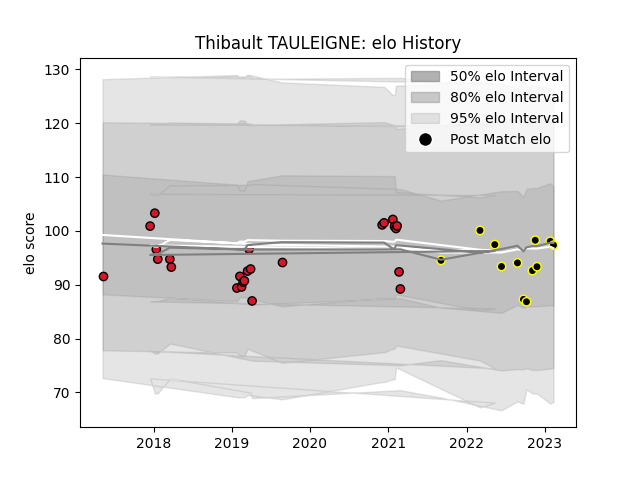

---  
layout: page  
title: Thibault TAULEIGNE  
date: 2023-02-24 02:31:15.432899  
categories: player  
---
# Thibault TAULEIGNE

## Positions: N8, L

## Current elo: 93.0

## Current Percentile: 51.0

# Elo History

# Match History

| Team           |   Appearances |   Win Rate |
|:---------------|--------------:|-----------:|
| Oyonnax        |            25 |       0.58 |
| Mont-de-Marsan |            10 |       0.6  |

| Opponent                   |   Matches |   Win Rate |
|:---------------------------|----------:|-----------:|
| Montauban                  |         4 |   0.375    |
| Aurillac                   |         3 |   0.666667 |
| Provence Rugby             |         3 |   0.333333 |
| Nevers                     |         3 |   1        |
| Carcassonne                |         2 |   1        |
| Mont-de-Marsan             |         2 |   0.75     |
| Soyaux-Angouleme           |         2 |   1        |
| Biarritz Olympique         |         1 |   0        |
| Vannes                     |         1 |   0        |
| Valence Romans Drome Rugby |         1 |   1        |
| US Bressane                |         1 |   1        |
| Toulon                     |         1 |   1        |
| Roval Drome XV             |         1 |   1        |
| Rouen                      |         1 |   0        |
| Perpignan                  |         1 |   0        |
| Colomiers                  |         1 |   1        |
| Pau                        |         1 |   0        |
| Bayonne                    |         1 |   0        |
| Brive                      |         1 |   0        |
| Massy                      |         1 |   1        |
| La Rochelle                |         1 |   0.5      |
| Connacht                   |         1 |   0        |
| Worcester Warriors         |         1 |   1        |