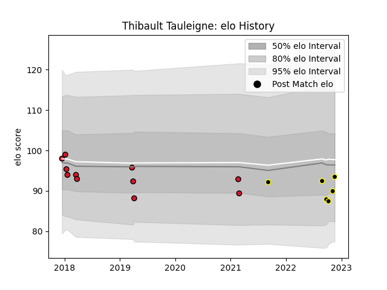

---  
layout: page  
title: Thibault Tauleigne  
date: 2022-11-22 11:41:18.487076  
categories: player  
---
# Thibault Tauleigne

## Positions: N8, L

## Current elo: 93.0

## Current Percentile: 26.0

# Elo History

# Match History

| Team           |   Appearances |   Win Rate |
|:---------------|--------------:|-----------:|
| Oyonnax        |            11 |   0.5      |
| Mont-de-Marsan |             6 |   0.666667 |

| Opponent           |   Matches |   Win Rate |
|:-------------------|----------:|-----------:|
| Provence Rugby     |         2 |        0.5 |
| Aurillac           |         1 |        1   |
| Biarritz Olympique |         1 |        0   |
| Brive              |         1 |        0   |
| Colomiers          |         1 |        1   |
| Connacht           |         1 |        0   |
| La Rochelle        |         1 |        0.5 |
| Massy              |         1 |        1   |
| Montauban          |         1 |        0   |
| Nevers             |         1 |        1   |
| Pau                |         1 |        0   |
| Rouen              |         1 |        0   |
| Soyaux-Angouleme   |         1 |        1   |
| Toulon             |         1 |        1   |
| US Bressane        |         1 |        1   |
| Worcester Warriors |         1 |        1   |