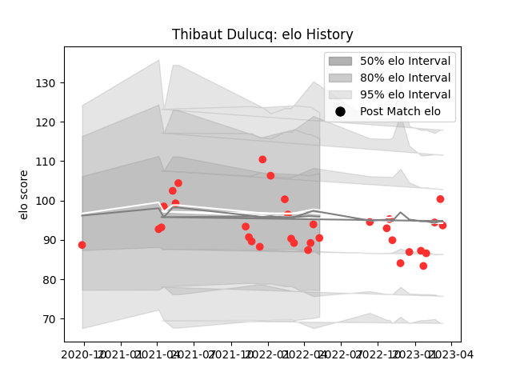

---  
layout: page  
title: Thibaut Dulucq  
date: 2023-01-17 11:34:12.897178  
categories: player  
---
# Thibaut Dulucq

## Positions: SH, FH

## Current elo: 89.0

## Current Percentile: 41.0

# Elo History

# Match History

| Team   |   Appearances |   Win Rate |
|:-------|--------------:|-----------:|
| Tarbes |            28 |   0.428571 |

| Opponent                   |   Matches |   Win Rate |
|:---------------------------|----------:|-----------:|
| Albi                       |         3 |   0.666667 |
| Blagnac                    |         3 |   0.333333 |
| Chambery                   |         3 |   0.333333 |
| Cognac Saint Jean d'Angély |         3 |   1        |
| Valence Romans Drome Rugby |         3 |   0.333333 |
| Aubenas                    |         2 |   1        |
| Bourgoin-Jallieu           |         2 |   0.5      |
| Nice                       |         2 |   0        |
| Suresnes                   |         2 |   0        |
| Dax                        |         1 |   1        |
| Dijon                      |         1 |   0        |
| Massy                      |         1 |   0        |
| Narbonne                   |         1 |   0        |
| Soyaux-Angouleme           |         1 |   0        |