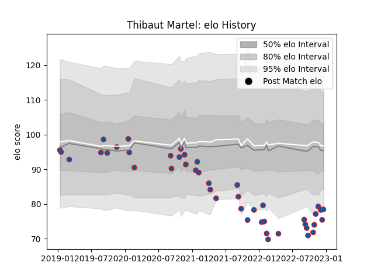

---  
layout: page  
title: Thibaut Martel  
date: 2023-03-21 18:35:37.959609  
categories: player  
---
# Thibaut Martel

Last updated: 2023-03-21
## Positions: FL, N8

## Current elo: 89.0

## Current Percentile: 3.0

# Elo History

# Match History

| Team     |   Appearances |   Win Rate |
|:---------|--------------:|-----------:|
| Grenoble |            59 |   0.567797 |

| Opponent                   |   Matches |   Win Rate |
|:---------------------------|----------:|-----------:|
| Vannes                     |         5 |   0.4      |
| Carcassonne                |         5 |   0.8      |
| Rouen                      |         4 |   0.5      |
| Montauban                  |         4 |   0.625    |
| Mont-de-Marsan             |         4 |   0.5      |
| Beziers                    |         4 |   0.75     |
| Nevers                     |         3 |   0.833333 |
| Aurillac                   |         3 |   0.666667 |
| Soyaux-Angouleme           |         3 |   1        |
| Provence Rugby             |         3 |   0.666667 |
| Oyonnax                    |         3 |   0.333333 |
| Agen                       |         3 |   0.666667 |
| Perpignan                  |         2 |   0.5      |
| Colomiers                  |         2 |   0        |
| Bayonne                    |         2 |   0.5      |
| Biarritz Olympique         |         2 |   0.5      |
| Benetton Treviso           |         1 |   0        |
| Narbonne                   |         1 |   0.5      |
| Massy                      |         1 |   1        |
| Harlequins                 |         1 |   0        |
| Clermont Auvergne          |         1 |   0        |
| US Bressane                |         1 |   0        |
| Valence Romans Drome Rugby |         1 |   1        |