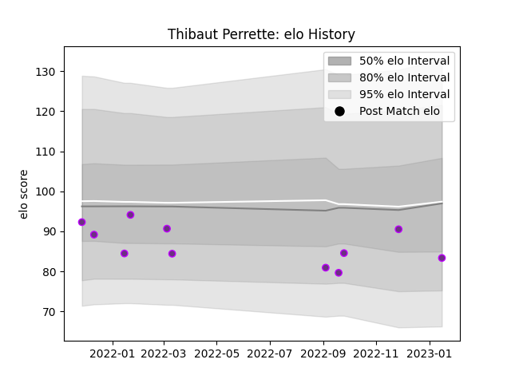

---  
layout: page  
title: Thibaut Perrette  
date: 2023-01-17 11:31:46.066447  
categories: player  
---
# Thibaut Perrette

## Positions: W, FB

## Current elo: 83.0

## Current Percentile: 37.0

# Elo History

# Match History

| Team        |   Appearances |   Win Rate |
|:------------|--------------:|-----------:|
| US Bressane |            11 |   0.272727 |

| Opponent                   |   Matches |   Win Rate |
|:---------------------------|----------:|-----------:|
| Albi                       |         1 |        0   |
| Blagnac                    |         1 |        1   |
| Chambery                   |         1 |        0   |
| Cognac Saint Jean d'Angély |         1 |        1   |
| Colomiers                  |         1 |        0   |
| Dax                        |         1 |        0   |
| Mont-de-Marsan             |         1 |        0   |
| Montauban                  |         1 |        0.5 |
| Narbonne                   |         1 |        0   |
| Nevers                     |         1 |        0   |
| Provence Rugby             |         1 |        0.5 |