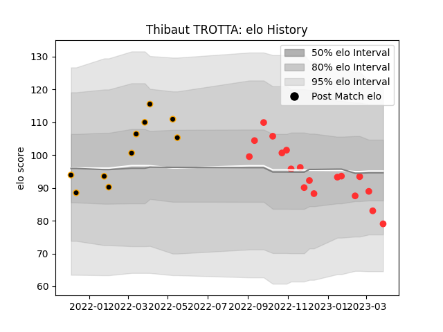

---  
layout: page  
title: Thibaut TROTTA  
date: 2023-01-31 10:55:35.930648  
categories: player  
---
# Thibaut TROTTA

## Positions: FB

## Current elo: 104.0

## Current Percentile: 67.0

# Elo History

# Match History

| Team     |   Appearances |   Win Rate |
|:---------|--------------:|-----------:|
| Tarbes   |            14 |   0.464286 |
| Chambery |             9 |   0.444444 |

| Opponent                   |   Matches |   Win Rate |
|:---------------------------|----------:|-----------:|
| Cognac Saint Jean d'Angély |         3 |   0.666667 |
| Bourgoin-Jallieu           |         2 |   1        |
| Chambery                   |         2 |   0.5      |
| Nice                       |         2 |   0        |
| Suresnes                   |         2 |   0.5      |
| Valence Romans Drome Rugby |         2 |   0        |
| Albi                       |         1 |   1        |
| Blagnac                    |         1 |   0.5      |
| Carqueiranne-Hyères        |         1 |   0        |
| Dax                        |         1 |   0        |
| Dijon                      |         1 |   1        |
| Massy                      |         1 |   0        |
| Rennes                     |         1 |   1        |
| Soyaux-Angouleme           |         1 |   1        |
| Tarbes                     |         1 |   0        |
| US Bressane                |         1 |   0        |