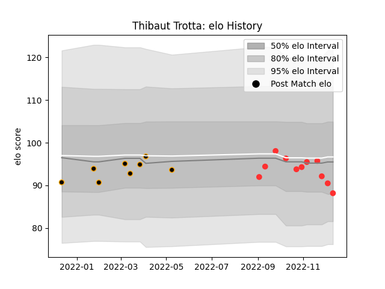

---  
layout: page  
title: Thibaut Trotta  
date: 2022-12-09 13:19:30.331907  
categories: player  
---
# Thibaut Trotta

## Positions: FB

## Current elo: 90.0

## Current Percentile: 37.0

# Elo History

# Match History

| Team     |   Appearances |   Win Rate |
|:---------|--------------:|-----------:|
| Tarbes   |            10 |        0.4 |
| Chambery |             8 |        0.5 |

| Opponent                   |   Matches |   Win Rate |
|:---------------------------|----------:|-----------:|
| Bourgoin-Jallieu           |         2 |        1   |
| Cognac Saint Jean d'Angély |         2 |        0.5 |
| Nice                       |         2 |        0   |
| Suresnes                   |         2 |        0.5 |
| Valence Romans Drome Rugby |         2 |        0   |
| Albi                       |         1 |        1   |
| Carqueiranne-Hyères        |         1 |        0   |
| Chambery                   |         1 |        0   |
| Dax                        |         1 |        0   |
| Dijon                      |         1 |        1   |
| Rennes                     |         1 |        1   |
| Soyaux-Angouleme           |         1 |        1   |
| Tarbes                     |         1 |        0   |