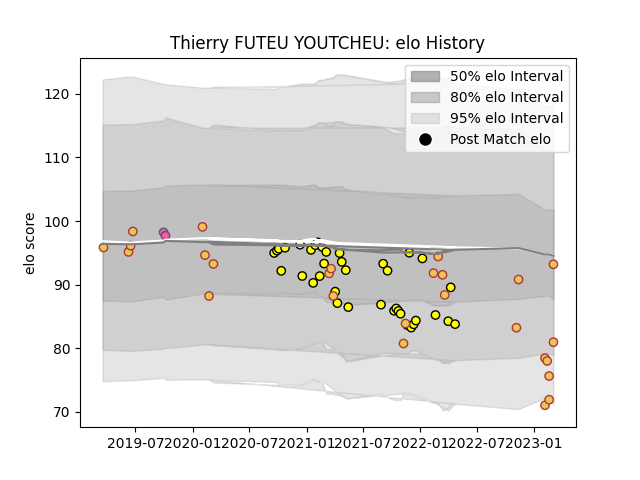

---  
layout: page  
title: Thierry FUTEU YOUTCHEU  
date: 2023-02-05 17:57:45.241072  
categories: player  
---
# Thierry FUTEU YOUTCHEU

## Positions: P

## Country: Spain

## Current elo: 74.0

## Current Percentile: 22.0

# Elo History

# Match History

| Team                 |   Appearances |   Win Rate |
|:---------------------|--------------:|-----------:|
| Carcassonne          |            38 |   0.473684 |
| Spain                |            21 |   0.619048 |
| Stade Francais Paris |             2 |   0        |

| Opponent                   |   Matches |   Win Rate |
|:---------------------------|----------:|-----------:|
| Montauban                  |         3 |   0.666667 |
| Beziers                    |         3 |   0.666667 |
| Russia                     |         3 |   1        |
| Rouen                      |         3 |   1        |
| Romania                    |         3 |   0.333333 |
| Provence Rugby             |         3 |   0.333333 |
| Georgia                    |         3 |   0        |
| Grenoble                   |         3 |   0.333333 |
| Mont-de-Marsan             |         2 |   0        |
| Valence Romans Drome Rugby |         2 |   0        |
| Soyaux-Angouleme           |         2 |   1        |
| Portugal                   |         2 |   0.5      |
| Perpignan                  |         2 |   0        |
| Oyonnax                    |         2 |   0        |
| Nevers                     |         2 |   0.5      |
| Aurillac                   |         2 |   0.5      |
| Vannes                     |         2 |   0.5      |
| Colomiers                  |         2 |   0.5      |
| Biarritz Olympique         |         2 |   0.5      |
| Germany                    |         1 |   1        |
| Canada                     |         1 |   1        |
| Bayonne                    |         1 |   0        |
| Uruguay                    |         1 |   1        |
| Tonga                      |         1 |   0        |
| Belgium                    |         1 |   1        |
| Brazil                     |         1 |   1        |
| Castres Olympique          |         1 |   0        |
| Namibia                    |         1 |   1        |
| Chile                      |         1 |   1        |
| Clermont Auvergne          |         1 |   0        |
| Fiji                       |         1 |   0        |
| Netherlands                |         1 |   1        |
| Narbonne                   |         1 |   1        |
| Agen                       |         1 |   1        |